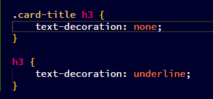
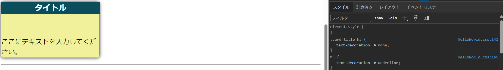
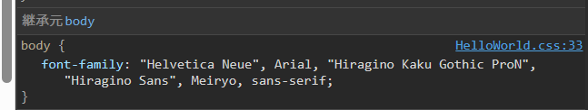

# CSSについて

## CSSの概要

``` css
selector {
    property:value;
}

```
のように記載する。

プロパティは大量にあるので、MDNで調べて使うようにすること。

[MDN](https://developer.mozilla.org/ja/docs/Web/CSS/Reference)はこちら

## テキストプロパティ

* text-align:文字の水平方向の配置を決める
  * center⇒真ん中
  * right⇒右寄せ
  
* font-weight：文字の太さを表す
  * Bold=700
  * Normal=400
  * サポートされていない値を指定すると、対応するフォントの中で一番近いフォントを表示してくれる
  
* text-decoration：テキストに線を表現できる
  * Underline：下線
  * none:aタグ等にもともとついている下線を失くす
  
* line-height：一行の高さを設定できる
  * 

* letter-spacing：文字と文字の間隔（横幅）を変更するためのプロパティ

* font-size:フォントのサイズ
  * px:最も使われる絶対単位
        ⇒絶対単位はレスポンシブなウェブサイトでは非推奨

* font-family:フォントの種類の変更ができる
  * [ブラウザで対応しているか/OS毎にどれだけ使える人がいるかを表したサイト](https://www.cssfontstack.com/)
  * フォントが無い場合もテキストは表示される。
  * fontは,区切りで指定もできる。

* text-transform: テキストをすべて大文字にしたりできる

## セレクタについて

* ユニバーサルセレクタ：全ての要素を対象にする
``` css
    * {
        color: blank;
    }
```

* 要素型セレクタ：タグの要素名で指定する
``` css
    h1 {
        color: white
    }
```

* セレクタ―リスト：, 区切りで要素を指定する方法
``` css


    h1, h2 {
        color: white
    }
```
* IDセレクタ：IDによって指定する
``` css
    #signup {
        color: test
    }

```

* 子孫セレクタ:要素とその子孫要素（何階層下でもいい）を半角区切りで指定することで、特定の要素の中の子要素だけを指定することができる。大きいサイトになると必須
``` css
  section span a {
    color : white;
  }

```

* 隣接セレクタ：同じ親要素の子要素で、その直後の要素を選択できる
  ⇒以下の場合は。h1と同じ階層で、直後のpを選択することができる。
``` css
  h1 + p {
    background-color: black;
  }
```

* 直下セレクタ：直下の要素だけを指定することができる
``` css
footer > a {
  color: black;
}
```

* 属性セレクタ:属性を指定して、スタイルを設定できる
* 
``` css
input[type="text"]{
  color: red;
}
```
   ⇒加えて、以下のように記載すると、aタグのhref属性に"google"を含む要素を指定することができる
``` css
a[href*=google] {
    color: red;
}
```

## 疑似クラス

以下疑似クラスのMDNリンク

https://developer.mozilla.org/ja/docs/Web/CSS/Pseudo-classes


### hover

以下のようにhoverをつけて書くと、buttonにマウスカーソルが当たった時のスタイルを設定することができる

``` css
button:hover {
  background-color:red;
}
```


### active

以下のようにactiveをつけて書くと、buttonをクリックしたときのスタイルを設定することができる

``` css
button:active {
  background-color:blue;
}
```

### checked

以下のようにcheckedをつけて書くと、ラジオボタンやチェックボックスにチェックを入れたときのスタイルを設定することができる

``` css
input[type="checkbox"]:checked{
    box-shadow: 0 0 0 3px red;
}
```

### box-shadow属性

影を生成するための属性
最近のデザインは影を使うことが多いので、重要な属性と言える

``` css

/* キーワード値 */
box-shadow: none;

/* 色と 2 つの長さの値 */
/* <color> | <length> | <length> */
box-shadow: red 60px -16px;

/* 3 つの長さの値と色 */
/* <length> | <length> | <length> | <color> */
box-shadow: 10px 5px 5px black;

/* 4 つの長さの値と色 */
/* <length> | <length> | <length> | <length> | <color> */
box-shadow: 2px 2px 2px 1px rgb(0 0 0 / 20%);

/* inset と長さの値と色 */
/* <inset> | <length> | <length> | <color> */
box-shadow: inset 5em 1em gold;

/* 複数の影はカンマで区切る */
box-shadow:
  3px 3px red inset,
  -1em 0 0.4em olive;

/* グローバルキーワード */
box-shadow: inherit;
box-shadow: initial;
box-shadow: revert;
box-shadow: revert-layer;
box-shadow: unset;

```

### nth-of-type(n)

以下のようにすると、同じクラスの中で、2の倍数個目のものを指定して、スタイルを指定することができる
``` css
.notTest .card:nth-of-type(2n){
    background-color: rgb(241, 241, 156);
}
```

## 疑似要素

特定の場所を指定することができる

### ::after
### ::before
### ::first-letter

要素の最初の文字を指定することができる


### ::firs-line
### ::selection


## CSSカスケードについて

CSSは後で指定された要素や、後で読み込まれているファイルの方が設定される

また、より詳細度が高いスタイルの方が、適用される
以下のように、子孫セレクタ等で、指定していれば詳細度が高いし
``` css
.notTest .card:nth-of-type(2n){
    background-color: rgb(241, 241, 156);
}
```

IDセレクタ &gt; クラス &gt; の順に詳細度が高くなる

例えば、以下のように書いたとして


ブラウザの開発者ツールで確認してみると
後に記載されたはずのh3の要素セレクタでの指示が消されているということが確認できる
(タイトルと記載されているのがh3要素)



もっと言うとインラインスタイルの方が詳細度が高いが
ファイル間でCSSを共有できないので、非推奨

また、以下のように!importantをつけると、絶対に色支持が適用されるようになる（非推奨）
``` css
button {
  color: magenda !important;
}
```


## 継承

以下のようにbody/section/form要素などにスタイルを定義すると、子要素には継承される（されないものもある）



## おすすめサイト

https://coolors.co/palettes/trending
⇒色のパレットを表示しているサイト

https://specificity.keegan.st/
⇒詳細度を計算してくれるサイト