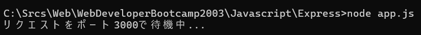
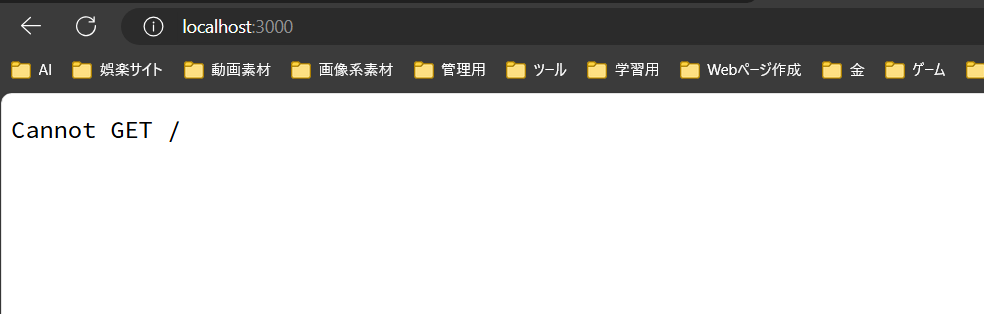
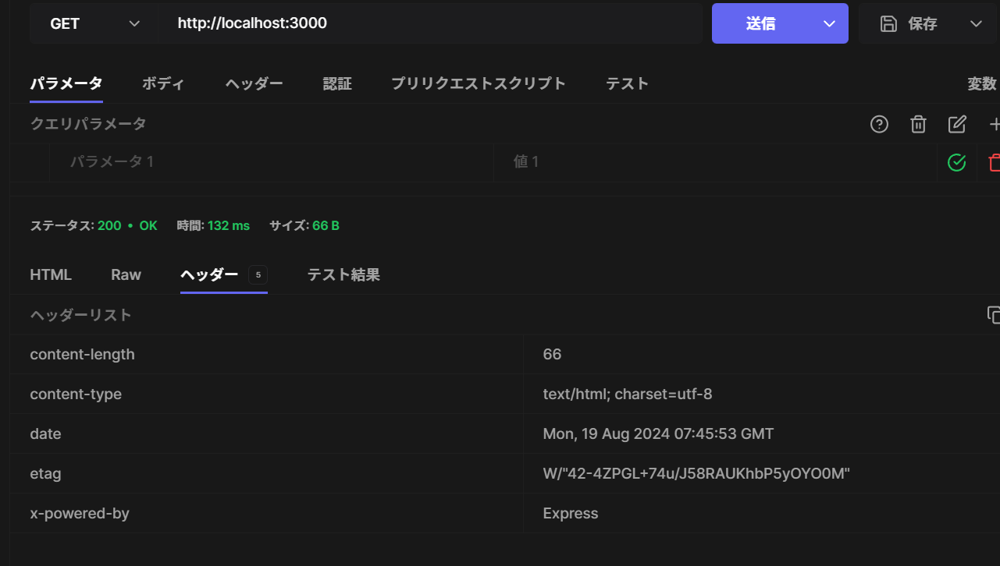
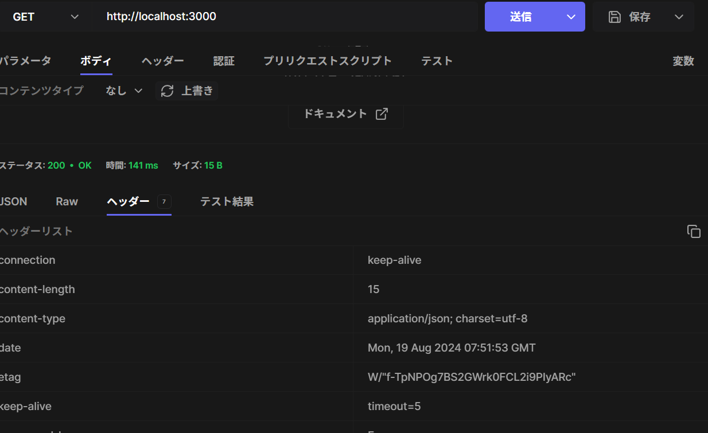
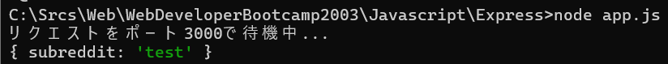

# Express入門

## Expressとは

Expressは「Node.jsのための高速で、革新的な、最小限のwebフレームワーク」であり、Webアプリケーションを構築するために、役立つ。

webアプリケーションやAPIを構築するためのメソッドやプラグインが豊富なnpmパッケージと言える

## ライブラリとフレームワークの違い（補足）

ライブラリを使うとき、主となるのは自分
アプリケーションフローを管理しているのも自分で、ライブラリを自分に従わせて使うイメージ

フレームワークでは、主従が逆tンして、フレームワークが主となり、自分がフレームワークのフローに従う


## Expressの使い方

npm i express
でインポートすることができる

その後、以下のようにポートを指定して、listenするとブラウザからアクセスすることができる。

```javascript
const express = require("express");

const app = express();  //expressを実行し、appという変数に返す

app.listen(3000, () => {
    console.log("リクエストをポート3000で待機中...")
})
```
上記jsファイルをnodeJSで実行すると、コマンドラインでは以下のようになる。（※ctrl + Cで待機状態を解除）


ブラウザで
localhost:3000
にアクセスしてみると、以下のようになる



### responseの返し方

以下のuse関数はリクエストがあった時に実行される関数
reqにリクエスト情報が入り、resを返すコールバック関数が実行される。

```javascript

app.use((req, res) => {
    res.send('リクエストを受けたので、レスポンスを返します');
})
```

上記のように記載した場合には、
特に返す型を指定していないため、
content-typeはtext/html; charset=utf-8となることがわかる




また、以下のようにsendのかっこ内に直接jsonの形で書いてみると
```javascript
app.use((req, res) => {
    res.send({color: 'red'});
})
```
以下のようにjsonファイルで返ってくることがわかる。



### ルーティング

pathによって、違うレスポンスを変えること

app.get()でpathの指定して、処理を書くことができる。
この際に、useはすべてのリクエストに反応してしまう。
もし、useの中でsendが記載されていると、
expressは一つのリクエストに対して、一つのレスポンスしかないため、useは消すこと

また、先に書いた順に実行されるので、それも注意すること

```javascript
app.get('/cats', (req, res) => {
    console.log("/catにリクエストが来ました！");
    res.send(`<h1>ニャー</h1>`)
})

app.post('/cats', (req, res) => {
    res.send(`<h1>postにリクエストが来ました</h1>`)
})

app.get('/dogs', (req, res) => {
    console.log("/catにリクエストが来ました！");
    res.send(`<h1>わんわん</h1>`)
})

app.get('/', (req, res) => {
    res.send("ここはホームページです");
})

//以下のように書いておけば、パスを間違えたときのレスポンスを指定することができる。
app.get('*', (req, res) => {
    res.send("そんなパスはしらない")
})
```

### パスパラメータ

以下のように書けば、/r/以下のパスすべてに対しての処理を記載することができる。

尚、以下のように記載した場合、
req.paramsの中にsubredditという属性を作り、
リクエストを受けたときのpathの/r/以下の値を
subredditの値として取得することができる。

```javascript
app.get('/r/:subreddit', (req, res) => {
    console.log(req.params);
})
```




これは、二つ以上のパラメータを設定することができる

### クエリストリング

URLの後ろに?をつけて、パラメ―タと値を指定すること


### nodemon

npm i -g nodemon
でインストールできる

毎回nodemonを起動しておくと、変更が自動的に検知し、
変更がかかった時に、再起動してくれる


