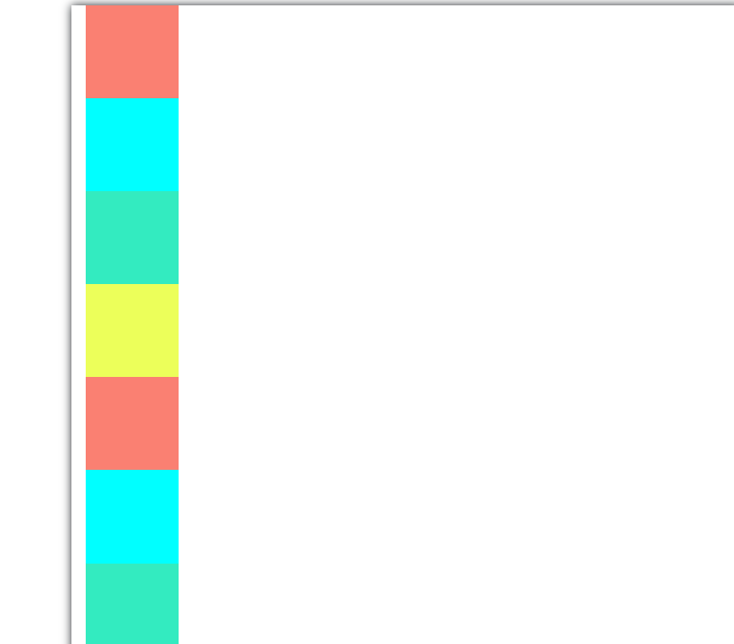
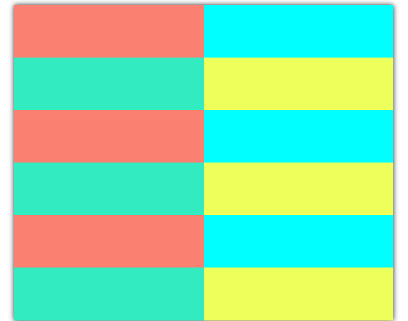
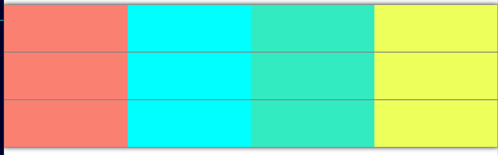

# Frexboxのまとめ

## 通常のFrexboxの設定の仕方

### 前提状態

HTMLで以下のセクションがあったとする
```html
    <section class="container">
        <div class="sq"></div>
        <div class="sq"></div>
        <div class="sq"></div>
        <div class="sq"></div>
    </section>
```

CSSでは、以下のように設定する

```css
.sq:nth-of-type(1){
    width:100px;
    height: 100px;
    background-color: salmon;
}
.sq:nth-of-type(2){
    width:100px;
    height: 100px;
    background-color: aqua;
}

.sq:nth-of-type(3){
    width:100px;
    height: 100px;
    background-color: #33ebc0;
}

.sq:nth-of-type(4){
    width:100px;
    height: 100px;
    background-color: #ecff5a;
}
```

すると、Divはblock要素なので、以下のように表示される


### 横にそろえる方法

もちろんDisplay:inlineと記載すると横に表示されるが
それだと、flexboxにはできないので、使わない

今回横に並べたいのは、Class="sq"だが
その上位要素のsection もしくは、containerクラスに対して以下の二つの指示を行うだけでよい

```css
.container {
    display: flex;
    flex-direction: row;
    
}
```
すると以下のように表示される
display:flexはflexboxを使う宣言で
flex-directionは主軸の方向を指定するもの
rowで主軸は横方向になり、交差軸は縦方向になる


### 主軸での並べ方を指定する方法

以下のjustify-contentで指定するだけ
以下のspace-betweenだと、等間隔に並べるという書き方
```css
    justify-content: space-between;
```

### 折り返す方法

以下の指定をするだけ
```css
flex-wrap: wrap;
```

### 交差軸の並べ方を変更する方法

以下の指定をするだけ
```css
    align-items: center;
```
いつもjustify-contentと逆に覚えているので、よく見返すこと


## Bootstrapの場合

### 元のコード

以下のように記載した
```html

    <section class="container">
            <div class="sq" style="background-color:salmon;"></div>
            <div class="sq" style="background-color:aqua;"></div>
            <div class="sq" style="background-color:#33ebc0;"></div>
            <div class="sq" style="background-color:#ecff5a;"></div>
            <div class="sq" style="background-color:salmon;"></div>
            <div class="sq" style="background-color:aqua;"></div>
            <div class="sq" style="background-color:#33ebc0;"></div>
            <div class="sq" style="background-color:#ecff5a;"></div>
            <div class="sq" style="background-color:salmon;"></div>
            <div class="sq" style="background-color:aqua;"></div>
            <div class="sq" style="background-color:#33ebc0;"></div>
            <div class="sq" style="background-color:#ecff5a;"></div>
     </section>
```

するとBootstrapでcontainerクラスはスタイルの指示がついているので、以下のようになる（二つ目のセクションは長いので見切れている）




### 横に並べるだけ

以下のようにsectionにrowクラスを設定するだけ
```html
<section class="container">
        <div class="row">
            <div class="sq" style="background-color:salmon;"></div>
            <div class="sq" style="background-color:aqua;"></div>
            <div class="sq" style="background-color:#33ebc0;"></div>
            <div class="sq" style="background-color:#ecff5a;"></div>
            <div class="sq" style="background-color:salmon;"></div>
            <div class="sq" style="background-color:aqua;"></div>
            <div class="sq" style="background-color:#33ebc0;"></div>
            <div class="sq" style="background-color:#ecff5a;"></div>
            <div class="sq" style="background-color:salmon;"></div>
            <div class="sq" style="background-color:aqua;"></div>
            <div class="sq" style="background-color:#33ebc0;"></div>
            <div class="sq" style="background-color:#ecff5a;"></div>
        </div>
    </section>
```

### 行を二列ずつ表示したいとき

以下のように、色付きの■にcolクラスを設定してあげる

```html

    <section class="container">
        <div class="row">
            <div class="sq col" style="background-color:salmon;"></div>
            <div class="sq col" style="background-color:aqua;"></div>
        </div>
        <div class="row">
            <div class="sq col" style="background-color:#33ebc0;"></div>
            <div class="sq col" style="background-color:#ecff5a;"></div>
        </div>
        <div class="row">
            <div class="sq col" style="background-color:salmon;"></div>
            <div class="sq col" style="background-color:aqua;"></div>
        </div>
        <div class="row">
            <div class="sq col" style="background-color:#33ebc0;"></div>
            <div class="sq col" style="background-color:#ecff5a;"></div>
        </div>
        <div class="row">
            <div class="sq col" style="background-color:salmon;"></div>
            <div class="sq col" style="background-color:aqua;"></div>
        </div>
        <div class="row">
            <div class="sq col" style="background-color:#33ebc0;"></div>
            <div class="sq col" style="background-color:#ecff5a;"></div>
        </div>

     </section>
```



### 画面サイズによって表示の列を変えたいとき

以下のように書けば、
```html
    <section class="container-xl">
        <div class="row"   style="border: gray solid 1px;" >
            <div class="sq col-6 col-lg-3" style="background-color:salmon;"></div>
            <div class="sq col-6 col-lg-3" style="background-color:aqua;"></div>
            <div class="sq col-6 col-lg-3" style="background-color:#33ebc0;"></div>
            <div class="sq col-6 col-lg-3" style="background-color:#ecff5a;"></div>
        </div>
        
        <div class="row" style="border: gray solid 1px;">
            <div class="sq col-6 col-lg-3" style="background-color:salmon;"></div>
            <div class="sq col-6 col-lg-3" style="background-color:aqua;"></div>
            <div class="sq col-6 col-lg-3" style="background-color:#33ebc0;"></div>
            <div class="sq col-6 col-lg-3" style="background-color:#ecff5a;"></div>
        </div>
        <div class="row"  style="border: gray solid 1px;" >
            <div class="sq col-6 col-lg-3" style="background-color:salmon;"></div>
            <div class="sq col-6 col-lg-3" style="background-color:aqua;"></div>
            <div class="sq col-6 col-lg-3" style="background-color:#33ebc0;"></div>
            <div class="sq col-6 col-lg-3" style="background-color:#ecff5a;"></div>
        </div>

     </section>
```


