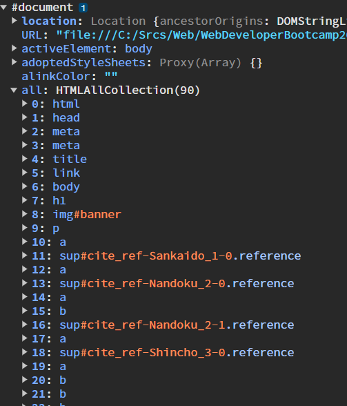

# DOM

## documentオブジェクト

HTMLとCSSからJavascriptのオブジェクトが生成される

コマンドラインで、以下のコマンドを実行してみると
Documentオブジェクトのプロパティがわかるはず


この講習では以下のファイルを使って試していく
C:\Srcs\Web\WebDeveloperBootcamp2003\Javascript\DOM入門\Manipulating\index.html

all以下にはすべてのHTML要素が含まれている。



以下のようにコンソール画面でdocument.all[15]と入力すれば、要素を表示してくれるが、これはChromeがHTMLで表示してくれているだけ。


オブジェクトの情報を見たいなら、以下のように入力すること
```javascript
console.dir(document.all[15])
```

この要素の文字列は、innerTextというプロパティで設定されているので、
```javascript
document.all[15].innerText="HOGE"
```
と入力すれば、この要素内のテキストはHOGEに書き換わる。

というようなものがDocumentオブジェクト

## 要素の取得メソッド

### getElementById : IDによる取得

対象のIDを入力することで、そのIDの要素を取得する。
※存在しないIDを指定した場合はNullが返ってくる。
```javascript
const banner = document.getElementById("banner");   //これでオブジェクトを取得
console.dir(banner);        //確認用
```

### getElementsByTagName : 要素名による一括取得

※存在しないIDを指定した場合は空のHTML Collectionが返ってくる。
```javascript
document.getElementsByTagName("img");   //これでimg要素をすべてを取得
```

これによって、複数のHTMLのオブジェクトが返ってくるが、
これをHTML Collectionという。
HTML Collectionは配列っぽいが、配列ではないことに注意

### getElementByClassName : クラス名による取得
※存在しないIDを指定した場合は空のHTML Collectionが返ってくる。
```javascript
document.getElementsByTagName("square");   //これでsquareクラスをすべてを取得
```

### querySelector: CSSのセレクタを使って取得

CSSで使っていたすべてのセレクタを使って、オブジェクトを取得できる。
ただし、一番最初に見つかった要素を取得することができる
```javascript
document.querySelector("img:nth-of-type(2)");
document.querySelector("a[title="Hitsuji"]");
```

### querySelectorAll: CSSのセレクタを使って一致するすべてのオブジェクトを取得

```javascript
document.querySelector("p a");
```

## 要素の操作

よく使われるメソッド・プロパティ

* classList
* getAttribute()
* setAttribute()
* appendChild()
* append()
* prepend()
* removeChild()
* remove()
* createElement
* innerText
* textContent
* innerHTML
* value
* parentElement
* children
* nextSibling
* previousSibling
* style

### innerText/innerHTML/textContent

#### innerText

表示されているtextをすべて取得・設定できる。
※こちらに

```javascript
document.querySelector("p").innerText
```
結果↓
'ニワトリという和名は「庭に飼う鳥」、 つまり家禽という意味から名づけられた[1]。ニワトリは普通「鶏」と書かれるが、「家鶏」で「にわとり」と充てることもある[2]。ニワトリは古くはカケ（鶏）と呼ばれた[2]。代表的な鳥であるため、単に「とり」ともよばれる[3]。雄のニワトリは「雄鶏（牡鶏）」（おんどり）、雌のニワトリは「雌鶏（牝鶏）」（めんどり）と呼ばれる[2][3]。'


#### innerHTML

ノード内のすべての要素を取得・設定できる

```javascript
document.querySelector("p").innerText
```
結果↓
```htm
'\n    ニワトリという和名は「<a href="/wiki/%E5%BA%AD" title="庭" style="color: red; text-decoration-color: magenta; text-decoration-style: wavy;">庭</a>に飼う鳥」、\n    つまり家禽という意味から名づけられた<sup id="cite_ref-Sankaido_1-0" class="reference"><a href="#cite_note-Sankaido-1" style="color: red; text-decoration-color: magenta; text-decoration-style: wavy;">[1]</a></sup>。ニワトリは普通「鶏」と書かれるが、「家鶏」で「にわとり」と充てることもある<sup id="cite_ref-Nandoku_2-0" class="reference"><a href="#cite_note-Nandoku-2" style="color: red; text-decoration-color: magenta; text-decoration-style: wavy;">[2]</a></sup>。ニワトリは古くは<b>カケ</b>（鶏）と呼ばれた<sup id="cite_ref-Nandoku_2-1" class="reference"><a href="#cite_note-Nandoku-2" style="color: red; text-decoration-color: magenta; text-decoration-style: wavy;">[2]</a></sup>。代表的な鳥であるため、単に「とり」ともよばれる<sup id="cite_ref-Shincho_3-0" class="reference"><a href="#cite_note-Shincho-3" style="color: red; text-decoration-color: magenta; text-decoration-style: wavy;">[3]</a></sup>。雄のニワトリは「<b>雄鶏</b>（牡鶏）」（<b>おんどり</b>）、雌のニワトリは「<b>雌鶏</b>（牝鶏）」（めんどり）と呼ばれる<sup id="cite_ref-Nandoku_2-2" class="reference"><a href="#cite_note-Nandoku-2" style="color: red; text-decoration-color: magenta; text-decoration-style: wavy;">[2]</a></sup><sup id="cite_ref-Shincho_3-1" class="reference"><a href="#cite_note-Shincho-3" style="color: red; text-decoration-color: magenta; text-decoration-style: wavy;">[3]</a></sup>。\n  '
```

#### textContent

改行コードとかもとってくる

```javascript
document.querySelector("p").textContent
```

'\n    ニワトリという和名は「庭に飼う鳥」、\n    つまり家禽という意味から名づけられた[1]。ニワトリは普通「鶏」と書かれるが、「家鶏」で「にわとり」と充てることもある[2]。ニワトリは古くはカケ（鶏）と呼ばれた[2]。代表的な鳥であるため、単に「とり」ともよばれる[3]。雄のニワトリは「雄鶏（牡鶏）」（おんどり）、雌のニワトリは「雌鶏（牝鶏）」（めんどり）と呼ばれる[2][3]。\n  '

### 属性操作

#### getAttribute

属性の値を取ってくる

```javascript
const firstLink = document.querySelector("a");
firstLink.getAttribute("href");     //'/wiki/%E5%BA%AD'
```

#### setAttribute

属性を指定して、設定できる。

```javascript
const textInput = document.querySelectorAll(input)[1];
textInput.setAttribute("type", "password")
```

### style操作

#### styleプロパティを直接見る・代入する

styleプロパティにアクセスすることで、**インラインで書かれた**CSSプロパティが表示される.

また、CSSのプロパティ名と違って、すべてcamelケースになっている。

```javascript
const h1 = document.querySelector("h1");
h1.style;
```

上記方法だと、大変なので、CSSでクラスに対して、色を指定しておいて、
Javascriptでクラスを変更する方がいい。

#### getComputedStyle : 最終的に割り当てられるスタイルを取得する

```javascript
getComputedStyle(h1).color; //'rgb(128, 0, 128)'
getComputedStyle(h1).fontFamily //'"Source Han Code JP"'
```

### classList

クラスを属性として考えて、setAttributeメソッドを使ってクラスを変更することもできるが、
複数のクラスを設定する場合は大変になってしまう。


classListを使うことで、簡単にクラスを変更することができる

#### add

```javascript
h2.classList.add("purple");
```

#### remove

```javascript
h2.classList.remove("purple");
```

#### contains

true/falseでクラスが適用されているかどうかを返す

```javascript
h2.classList.contains("purple");
```

#### toggle(重要)

クラスが適用されているか判断し、
適用されていれば、外してくれて
適用されていなければ、適用してくれる

```javascript
h2.classList.toggle("purple");
```

### 親・子・兄弟

#### parentElement

Javascriptでは、ボタンを押したとき、その親要素に対して、何かを追加することがよくある。
以下の方法で親要素を取得することができる。

```javascript
const firstBold = document.querySelector("b");
firstBold.parentElement //親要素を取得
```

#### chirdren

```javascript
const firstBold = document.querySelector("b");
const paragraph = firstBold.parentElement //親要素を取得

paragraph.children     //全ての子要素
```

#### nextSibling

次のNodeを取得する

```javascript
const firstBold = document.querySelector("b");

paragraph.nextSibling     //隣のNode
```


#### nextElementSibling

次の**要素**を取得する

```javascript
const firstBold = document.querySelector("b");

paragraph.nextElementSibling     //隣のNode
```

previousもある


### 要素の追加


#### createElement

要素を作ることができる

```javascript
const newImg = document.createElement("img");
newImg.src = "https://images.unsplash.com/photo-1563281577-a7be47e20db9?ixlib=rb-1.2.1&ixid=eyJhcHBfaWQiOjEyMDd9&auto=format&fit=crop&w=2550&q=80"
```

ただし、上記だけだとどこに置かれるのかわからない。


#### appendChild

要素を子要素として、一番後ろに追加することができる。


#### append

二つ以上まとめて追加することができる。
※IEでは使えない。
```javascript
p.append("あああああああ", "いいいいいいい")
```

#### insertAdjacentElement

要素と要素の間に、要素を追加することができる。
一つ目の引数で、どの位置に追加するのを指定する。

```javascript
h1.insertAdjacentElement('afterend', h2);
```

これはややこしいので、以下のリンクをみること。
https://developer.mozilla.org/ja/docs/Web/API/Element/insertAdjacentElement

重要なポイントは以下

```javascript
<!-- beforebegin -->
<p>
  <!-- afterbegin -->
  foo
  <!-- beforeend -->
</p>
<!-- afterend -->
```

#### after

基準となる要素の後ろに要素を追加することができる。
これもIEで使えない。

#### before

基準となる要素の前に要素を追加することができる。
これもIEで使えない。


### 要素の削除

#### removeChild

子要素を削除する

```javascript
const firstLi = document.querySelector("li");   //消したい対象
const ul = firstLi.parentElement    //親要素を取得
ul.removeChild(firstLi);    //削除

firstLi.parentElement.removeChild(firstLi); //このようにも書けるが、、、
```

#### remove

要素を削除する
※IEでは使えない。
```javascript
const firstLi = document.querySelector("li");   //消したい対象
firstLi.remove();
```
