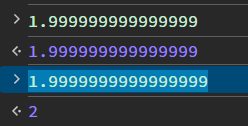
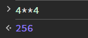
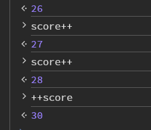
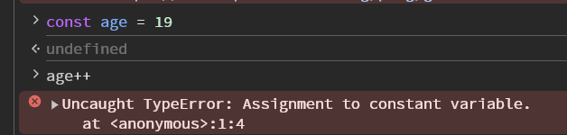
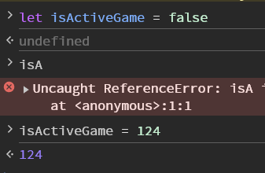
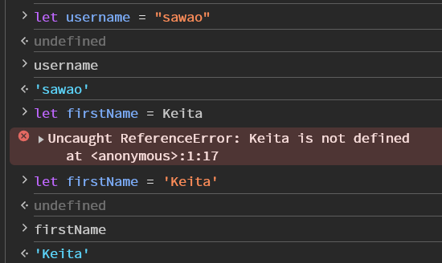

# Javascriptの基本


## プリミティブ型

元々Javascriptに用意された構成要素について学習していく
* Number
* String
* Boolean
* Null
* Undifined

<hr>

### コンソールの表示

Chromeの開発者ツールから利用できる
WindowsのChromeの場合、Ctrl+Shift+Iで開発者ツールを表示できる

また、コンソールタブを開き、歯車マークの隣の三点リーダーをクリックし、
以下の赤線のアイコンをクリックすることで、コンソールだけを表示することができる


<hr>

### Number

Javascriptにおける数値の役割
* JSには数値が一つしかない
* 正の数
* 負の数
* 整数
* 浮動小数点

コンソール画面だけなのかはわからないが、
1.999999999999999まではそのまま表示されるが、
以下のように1.9999999999999999と入力すると、繰り上げられてしまう



また、JSで特殊な演算子として、**がある
4**4と入力すると、4の4乗となる




#### NaN

Not a Numberの略
数字じゃないことを示す値
NaN自体はNumber型ではあるものの、
0除算してしまったときとかにNaNで返ってくる
（以下のtypeofは型を示す関数


<hr>

### 変数

#### 基本的な構文
```javascript
let someName  = value;
let year = 1985; //具体例
```
※ちなみに、セミコロンが無くても動く

#### 計算

他の言語でもそうなのかもしれないが、知らなかった
以下のように、++は後ろにつけると、計算前の値が返ってくる


逆に++を前につけると、計算後の値が返ってくる



#### const
これはほかの言語と同じ
letと同じように宣言できるけど、後から変えられない

```javascript
const someName  = value;
const age = 19; //具体例
age++; //エラー
```



#### var
昔はvarしか使えなかった
今も使えるが使われなくなった


<hr>

### Boolean

これはほかの言語とだいたい同じ
注意すべきなのは、trueとfalseは最初小文字であること

ちなみに、Javascriptでは型を変更することができる
（Typescriptはできない）



<hr>

### 変数の命名規則

#### 絶対に守らないといけないルール

* 数字から始まる変数名はNG

#### 技術者として守ったほうがいいルール

* camel caseで記載すること（currentYearみたいに、最初の単語を小文字にして、二つ目以降の単語の最初の文字は大文字にすること）
* わかりやすい変数名にすること
* Booleanの変数名の始まりにはisをつけること

<hr>

### String

宣言するときは他と同じくletを使う
ただし、シングルクォーテーションかダブルクォーテーションでくくってあげる必要がある

```javascript
let firstName = 'Keita'
let username = "sawao"
```

※くくらないと以下のようなエラーになる




#### 注意点

シングルクォーテーションかダブルクォーテーションはどちらも使えるが、どっちかに統一はしよう
※ただし、I'm happyという文章を書きたいときには、ダブルクォーテーションしか使えないので、そういった場合は除く

#### インデックス

String型は0, 1, 2,...から始まる番号が振られている


#### stringの連結

以下のように、文字列をつなげることができる（数字を含めるとString型として認識される）


#### よく使うメソッド

以下で確認することはできる
https://developer.mozilla.org/ja/docs/Web/JavaScript/Reference/Global_Objects/String

* toUpperCase():全て大文字にする
* trim():きれいなStringにすることができる。（文字列の両端の無駄な空白を失くしてくれる）
* indexOf("文字"):特定の文字か文字列が何個目のIndexの配列に入っているかを返す
* slice(最初のIndex, 終わりのIndex)：文字列を切り取れる。-を指定すると、後ろから数えたIndexを指定する
* replace("置き換える対象の文字", "置き換える文字")：最初に見つかった文字列を置きかえる
* repeat(数値):引数の分だけ繰り返して、文字列をつなげる
* 

<hr>

### テンプレートリテラル

文字列の中に変数や式、改行を含めることができる便利な構文
以下はバックティック文字(Shift+@)であって、シングルクォーテーションではないことに注意
```javascript
`I counted ${3 + 4} sheep`
```

<hr>

### Null

意図的に値がないことを示す。
他の言語と違って、あまり使われないらしい

<hr>

### undifined

Javascript的にわからないということ
以下のように配列の外のIndexを指定すると、Undifinedが返ってくる


<hr>

### Mathオブジェクト

計算用のメソッドが使えるオブジェクト
ちなみに、以下のようにMathと入力すると、Mat23322hをオブジェクト内のメンバーやメソッドが表示される


* Math.random():０～1までの小数をランダムで表示する(0と1は含まない)
  ※randomは整数で表示することができない
* Math.floor(数値):小数点部分を切り捨て

そのため、0～4までの5個の値のうちいずれかを表示したい場合は以下のように記載する。
randomが0.000000000001～0.9999999999999
のような感じなので、一桁目が何になるのかを考えると、×5とすれば、0.000000～4.9999999になる。
なので、一桁目だけを取りだっせば、0～4になる

``` javascript
Math.floor(Math.random()*5)
```

### javascriptファイルの活用

jsファイルにJavascriptを書き、HTMLファイルに読み込ませればファイルを実行することができる。
HTML側に以下のコードを記載する。
※HTMLやCSSを記載した後に、実行する必要があるため、**Bodyタグの終わりの直前**に記載すること。
```javascript
    <script src="app.js"></script>
```

入出力で以下の関数が使えるので、まずはこれらをつかっていろいろ試してみる。

#### Console.log


Consoleに出力することができる。
```javascript
Console.log("hello")
```
#### alert
ブラウザがAlertを表示することができる
```javascript
alert("やっほー")
```

#### prompt
ブラウザが入力ダイアログを表示することができる
```javascript
prompt("数字を入力してください")
```

#### parseInt
文字列になっている数値をInt型に変更することができる。
```javascript
parseInt("123")
```

<hr>

## 条件分岐

ほぼほぼ他の言語と同じ。

### ==(ダブルイコール)
* 値が等しいかチェックするが、型が等しいかはチェックしない。
* 値の型が異なる場合は、型の変換を試みてから比較を行う。
* 上記のせいで意図しない結果になる可能性がある。

```javascript
null == undefined //true
0 == false //true
1 == '1' //true
```


### ===(トリプルイコール)
* **値が等しいかと、型が等しいかどうか**を厳密にチェックする
  
```javascript
null === undefined //false
0 === false //false
1 === '1' //false
```

※!==は上記の結果の逆(true⇔false)になる。


### if文の注意点
ifとelse ifで内包される条件がいくつもある場合は、最初に条件に一致した条件分岐が適用される。


### TRUTHY/FALSYな値

Javascriptの値はすべてtrueまたはfalseとみなすことができる。

* falsyな値
  * false
  * 0
  * ""(空文字)
  * null
  * undefined
  * NaN
* 上記以外はtruthyな値

例えば、以下のようにすると結果はFALSYになる。
上記FALSYの値を以下のNaNに入れ替えても同様の結果となる。
```javascript
if (NaN) {
    console.log("TRUTHY")
}
else {
    console.log("FALSY")
}
```

### switch

おそらく、C系と同じだが、忘れがちなので例文を記載しておく

```javascript
const day = prompt("数字を入力してください");

switch (parseInt(day)) {
    case 1:
        console.log("月曜日");
        break;
    case 2:
        console.log("火曜日");
        break;
    case 3:
        console.log("水曜日");
        break;
    case 4:
        console.log("木曜日");
        break;
    case 5:
        console.log("金曜日");
        break;
    case 6:
    case 7:
        console.log("週末です")
        break;
    default:
        console.log("無効な数字です");
}
```

## 配列

### 豆知識

* "string" is **NOT** array.

* Javascriptの配列には違う型も入れられる。配列も入れられる

* 文字列の配列があったとして、str[0]=”Sawao”なら、str[0][0]＝"S"になる。
* 文字列は上書きすることができないが、配列なら変えることができる。
* 配列が定義されていないところに、値を入力することもできる。


### Method

* **push**() : add the last value to Array. And return the value of Array.length
* **pop**(): Remove the last value from array. And return the removed value.
* **shift**(): Remove the first value from Array. And return the removed value. If the array is empty, return "**undefined**"
* **unshift**() : Add the first value to Array. And return the added value.
* **concat**: 配列を結合
* **includes** : 要素を検索
* **indexOf**:string.indexOfと似ている
* **join**:配列からStringを生成
* **reverse**:配列を反転して逆順にする。
* **slice**:配列を部分的にコピーして、新たに作成する（元の配列は変わらない。）
* **splice**:要素を取り除いたり、置き換えたりする(配列自体を変更する。)
* **sort**:配列の要素をソートする


#### splice

これは少しわかりにくいので、メモ
```javascript
let colors = ["red", "orange", "green", "yellow", "blue", "white"];
colors.splice(3, 1); //indexが3のyellowが消える
colors.splice(2, 0, "purple"); //index2にpurpleが追加される
```
消した値を配列として返す

### 配列のアドレス

以下のように、配列そのものを＝で代入すると、
その変数には代入された配列が記録されているメモリのアドレスが代入される。
```javascript
let nums = [1, 2, 3];
let numsCopy = nums;
nums.push(4);
console.log(nums); //[1, 2, 3, 4]
console.log(numsCopy); //[1, 2, 3, 4]
```

なので、constで配列を定義しても、
配列のアドレスが変わらないという宣言になるだけなので
constで定義してもpushだったりで、配列の中身は変えることができる。

## オブジェクト
* オブジェクトはプロパティの集合体
* プロパティは**キーとペア**
* インデックスでデータにアクセスするのではなく、キーを使ってアクセスする。

### オブジェクトの宣言

```javascript
const person = {
  firstName = "Keita",
  lastName = "Sawao",
  age = 31
};
```

### オブジェクトのプロパティへのアクセスの仕方

以下のようにアクセスすることもできる
```javascript
const person = {
  firstName = "Keita",
  lastName = "Sawao",
  age = 31
};

person["first" + "Name"];

const key = "firstName"
person[key];
```
もちろん、他の言語のように.を使ってアクセスもできるが、文字列の組み合わせだったり、変数を使ってkeyを使いたいなら、大かっこで指定するのもありですね。


### プロパティの追加の仕方

新しいプロパティ名と値を入力すれば、追加される
```javascript
const teamKumagaya = {
    Sawao: 40,
    Mori: 60
}

teamKumagaya.Goto = 80;
console.log(teamKumagaya); //{Sawao: 40, Mori: 60, Goto: 80}
```


## 繰り返し処理

基本的にＣ＋＋と同じっぽい

### for...of

配列の要素を順番に処理できる。
Javascriptの中でも新しいので、IEでは使えない。

```javascript
for(変数 of 列挙可能なオブジェクト){
  //処理の内容
}


//--------------以下例----------------

const subreddits = [
    "cooking",
    "books",
    "chickens",
    "life",
    "pics",
    "soccer",
    "movies"
]

for (let subreddit of subreddits) {
    console.log(subreddit);
}

```

列挙可能なオブジェクトは配列以外にも、Stringなども使える。

### オブジェクトに対してfor...ofを使う

例えば、以下のようなオブジェクトがあったとする
```javascript
const testScores = {
    ken:80,
    yuki:67,
    taro:89,
    ryota:91,
    yuma:72,
    yuko:77,
    chiaki:83,
    kota:97,
    saeko:81,
    koki:60
}

```
もし、以下のようにfor...ofを使うとエラーが起きる。これはオブジェクトが列挙可能ではないから。

```javascript
for (let x of testScores) {
    console.log(x);
}
```


なので、この場合はObject.Keys(オブジェクト名)を使う
```javascript
for (let student of Object.keys(testScores)) {
    console.log(`${student}さんの点数は${testScores[student]}です。`);
}
```

### for...in

for...ofのオブジェクト対応版
```javascript
for (let student in testScores) {
    console.log(`${student}さんの点数は${testScores[student]}です。`);
}
```

### 講義では触れなかったため、後で調べる必要があるもの

ジェネレータ―
シンボル

## 関数

### 定義の仕方

```javascript
function funcName() {
  //何らかの処理
}
```

定義が記載される前に、実行することもできる。


### スコープ

変数が「参照できるか」
どこで変数を定義したかで、どこからその変数を参照できるかが決まる。
例えば、以下のtotalは関数内で定義された変数なので、関数外ではスコープ外といえる。

```Javascript
function collect() {
    let total = 6
}
console.log(total); //error
```
また、関数の外で宣言された変数は関数の中でも使うことができる。
ただし、同じ名称の変数が関数内にあるなら、関数内の変数の値が優先される。


### ブロックスコープ

以下のように中かっこの中で定義された変数は、中かっこ外で使うことができない。
この中かっこ内で参照できることをブロックスコープであるといえる。

```javascript
let radius = 8;
if (radius> 0) {
    const PI = 3.14;
    let msg = "hogehoge";
}
console.log(radius) //error
console.log(PI);    //error
console.log(msg);   //error
```

昔はvarで変数を宣言していたが、その際には、ブロックスコープという概念がなかった。
なので、varを使えば、中かっこ内で宣言したものでも、中かっこ外で利用することができない。

### レキシカルスコープ

どこで定義されたかによって、変数が参照できるかが決まる
変数は、使われる関数の直前で定義した変数の値が代入される。

```javascript
    function bankRobbery() {
    //変数を宣言
    const heroes = ['スパイダーマン', 'スーパーマン', 'ブラックパンサー'];
    
    //上記配列を使う関数を定義
    function help () {
        for ( let hero of heroes) {
            console.log(`助けて、${hero}!!!`);
        }
    }
    help();
}
```

なので、同じ変数名を多用しているのであれば、このレキシカルスコープを見ること。

### 関数式の書き方

関数の定義は以下のようにも書くことができる
```javascript
const add = function (x, y) {
    return x + y;
} 
```

### 高階関数

関数を受け取ったり関数を返す関数のこと

#### 引数として関数を受け取る

Javascriptなら引数として関数を受け取ることもできる。
ただし、関数を引数として渡したいなら、()はつけてはならない。
()をつけるとその瞬間に実行されてしまう

```javascript
function callTwice(func) {
    func();
    func();
}

function rollDie() {
    const roll = Math.floor(Math.random() * 6) + 1;
    console.log(roll);
}

callTwice(rollDie);
callTwice(rollDie());   //error
```


#### 関数を返す

Javascriptなら引数として関数を返すこともできる。
返り値が関数となるだけなので、以下のmakeRandomFunc()を実行しても返り値の関数が実行されるわけではない。
返り値を受け取る関数を用意して、それを実行することで返ってきた関数を実行することができる。

```javascript
function makeRandomFunc() {
    const rand = Math.random();
    if (rand > 0.5) {
        return function () {
            console.log('おめでとう！！！！！');
        }
    } else {
        return function () {
            alert('ウイルスに感染しました');
            alert('閉じないで');
            alert('閉じないで');
            alert('閉じないで');
            alert('閉じないで');
            alert('閉じないで');
        }
    }
}

const randomFunc = makeRandomFunc();

randomFunc();

```

以下のようなこともできる

```javascript
function maleBetweenFunc (min, max) {
    return function(num) {
        return num >= min && num <= max ;
    }
}

const isChild = makeBetweenFunk(0, 18);
isChild(40);    //false
isChild(9);     //true


const isAdult = makeBetweenFunk(19, 64);
isAdult(3)  //false
isAdult(30) //true

const isSenior = makeBetweenFunk(65, 120);
isSenior(34)    //false
isSenior(119)   //true
```

### メソッド

オブジェクトのプロパティに関数を定義できる。
これをメソッドという。

```javascript
const myMath = {
    PI: 3.14,
    square: function (num) {
        return num ** 2;
    },
    cube: function (num) {
        return num ** 3;
    },

    circle: function (radius) {
        return radius * radius * this.PI;
    },
    circumference: function (radius) {
        return 2 * radius * this.PI;
    }

}
```

以下のように省略することも可能

```javascript
const myMath = {
    PI: 3.14,
    square(num) {
        return num ** 2;
    },
    cube(num) {
        return num ** 3;
    },

    circle(radius) {
        return radius * radius * this.PI;
    },
    circumference (radius) {
        return 2 * radius * this.PI;
    }

}
```

### thisが使えるときと使えないとき

thisの値は、thisを使っている関数が「どのように呼ばれたか」に依存する。
以下のようになる。

```javascript
const Cat = {
    name: "タマ",
    color: "grey",
    breed: "アメリカンショートヘア",
    cry() {
        console.log(`${this.name}がニャーと泣きました。`)
    }
}

Cat.cry();  //タマがニャーと泣きました

const cry2 = Cat.cry;

cry2(); //がニャーと泣きました。
```

これは、cry2がwindowというオブジェクトの中に作られているから


### try-catch

try-catchはほかの言語と同じ
catchの後の()にeを引数とすることで、エラーメッセージを受け取りつつ、コードを止めることなく処理を続けることができる。

```javascript
function shout(msg) {
    try{
        console.log(msg.toUpperCase().repeat(3));
    }
    catch(e) {
        console.log(e);
        console.log('shoutには文字列を入れてください。')
    }
}
```


##　配列をコールバックを使ったメソッド

### forEach

配列オブジェクトのメソッドで、関数を引数として渡すことで、
配列内の各値を引数として、処理を行う関数を呼び出すメソッド

```javascript
const numbers = [1, 2, 3, 4, 5, 6, 7, 8, 9, 10, 11, 12, 13, 14, 15, 16, 17, 18, 19, 20]

function print(element) {
    console.log(element);
}

numbers.forEach(print);
```

実際には、上記のように書くことは少なく、
forEach内で関数を宣言して、使うことの方が多い。

```javascript
const numbers = [1, 2, 3, 4, 5, 6, 7, 8, 9, 10, 11, 12, 13, 14, 15, 16, 17, 18, 19, 20]

numbers.forEach(function (element) {
    console.log(element);
});
```

このメソッドはfor...ofと同じ
for...ofが使えるようになってからは、あまり使わなくなったらしい。

ただ、過去にはこれがよく使われていたので、見かけることは多いはず。

### map

配列オブジェクトのメソッドで、関数を引数として渡すことで、
配列内の各値を引数として、処理を行う関数を呼び出すメソッドで
こちらは、forEachと違って、各値を返り値として返すことができる。

```javascript
const numbers = [1, 2, 3, 4, 5, 6, 7, 8, 9, 10, 11, 12, 13, 14, 15, 16, 17, 18, 19, 20]

const doubles = numbers.map(function (num) {
    return num * 2;
})
```

### アロー関数

IEでは使うことはできない新しい関数式
関数式の簡潔版

以下の関数があったとする。

```javascript
const add = function (x, y) {
    retun x + y;
}
```

上記関数は以下のように書くことができる。
functionを消して、引数の後ろに=>を書けばOK
```javascript
const add = (x, y) => {
    retun x + y;
}
```

引数が一つだけのとき、以下のようにかっこを省略できる。


```javascript
const square = num => {
    retun num * num;
}
```

#### 暗黙的なreturn

さらに、retunも省略することも可能

```javascript
const square = num => (
    num * num
);
```
さらに、上記のように**一行だけなら**、もう少し、省略することもできる。
個人的には、以下の書き方が一番わかりやすいかも

```javascript
const square = num => num * num　;

const rollDie = () => Math.floor(Math.random() * 6) + 1

const makeFullName = (firstName, lastName) => firstName + " " + lastName
```

#### アロー関数＋map

mapも当然アロー関数でも使える
```javascript
const Users = [
    {
        firstName: "Keita",
        lastName: "Sawao",
        age: 31
    },
    {
        firstName: "Momoko",
        lastName: "Sawao",
        age: 30
    },
    {
        firstName: "Yuta",
        lastName: "Mori",
        age: 31
    },
    {
        firstName: "Takumi",
        lastName: "Goto",
        age: 31
    },
];
const showUserAge = Users.map(function (user) {
    return `${user.firstName.toUpperCase()} ${user.lastName.toUpperCase()}は${user.age}です。`
})
```
上記showUserAgeは以下と同じ

```javascript
const showUserAge = Users.map(user => `${user.firstName.toUpperCase()} ${user.lastName.toUpperCase()}は${user.age}です。`)
```

### 【番外編】setTimeoutとsetInterval

コールバックつながりで、setTimeOutとsetIntervalの説明。

#### setTimeout

他の言語では、sleepのように、ms単位で数値を指定することで処理を遅らせることができるが、javascriptではそういったことができないので、setTimeOutを使う
```javascript
setTimeout(関数 , 時間(ms) )

setTimeout(() => { console.log('やっほー') }, 3000);
```

#### setInterval

関数を指定した時間(ms)ごとに実行する関数
永遠に実行されてしまうので、止めることも指示する必要がある。

```javascript
const id = setInterval(() => { console.log(Math.floor(Math.random() * 6) + 1) }, 1000);

clearInterval(id);  
```


### filter

提供されたコールバック関数を持たす要素からなる新しい配列を生成する。

```javascript
const Users = [
    {
        firstName: "Keita",
        lastName: "Sawao",
        age: 31,
        score: 23
    },
    {
        firstName: "Momoko",
        lastName: "Sawao",
        age: 30,
        score: 89
    },
    {
        firstName: "Yuta",
        lastName: "Mori",
        age: 31,
        score: 76
    },
    {
        firstName: "Takumi",
        lastName: "Goto",
        age: 31,
        score: 56
    }
];

//ここで、60点以上のものをtrueとする条件式を書いたら、trueのものをgoodUsersという配列に代入していく
const goodUsers = Users.filter((user) => {
    return user.score >= 60
})

goodUsers.forEach(
    user => console.log(`${user.lastName}さんは${user.score}であるためgoodユーザーです`)
)
```

また、さらにmapとかけ合わせることもできる

```javascript
const goodUsers = Users
    .filter(user => user.score >= 60)
    .map(user => user.firstName + " " + user.lastName);


goodUsers.forEach(
    user => console.log(user)
)
```

### every

配列内のすべての要素が指定されたテスト関数を満たすかどうかをtrueかfalseで返す。

```javascript
const exams = [80, 98, 92, 78, 70, 90, 89, 84, 81, 77];

console.log(
    exams.every(exam => exam >= 75)     //false
);

console.log(
    exams.every(exam => exam >= 70)     //true
);
```


### some
配列内に指定された要素があるかどうかをtrueかfalseで返す。
条件に一致する要素が一つもなければfalseとなる。

```javascript
const exams = [80, 98, 92, 78, 70, 90, 89, 84, 81, 77];

console.log(
    exams.some(exam => exam >= 99)     //false
);

console.log(
    exams.some(exam => exam >= 75)     //true
);
```


### reduce()

配列の各要素に対して（引数で与えられた）reduce関数を実行して、「単一の出力値」を生成する。（最終的に一つの値にする）
例えば以下のようにしたとき、
```javascript
[3,5,7,9,11].reduce(function test(accumlatior, currentValue){
    return accumlatior + currentValue;
} )
```
結果は以下のようになる

| Callback | accumulator | currentValue | return value |
| -------- | ----------- | ------------ | ------------ |
| 1回目    | 3           | 5            | 8            |
| 2回目    | 8           | 7            | 15           |
| 3回目    | 15          | 9            | 24           |
| 4回目    | 24          | 11           | 35           |

つまり、accumuratorには初回は一番最初の要素が入っていて、currentValueは二番目の要素が入っている
二回目以降は、accumulatorにはretun valueが入っていて、currentValueには次の要素が入ってくる。

最終的に、accumulatorに一つの値が入ってくる。

```javascript
const exams = [80, 98, 92, 78, 70, 90, 89, 84, 81, 77];

console.log(
    exams.reduce((total, score) => total + score)   //839
);


//------確認-----------
let total = 0;

for (exam of exams) {
    total = total + exam;
}
console.log(total);     //**839**
```

つまり、各要素で処理を行って、その処理ごとにreturnされたものが一つ目の引数に代入されるので、最小値を求めることなんかもできる。


```javascript
const minScore = exams.reduce((min, score) => {
    if (min <= score) {
        return min;
    }
    return score;
})

console.log(minScore);  //70
```
また、reduceの二つ目の引数に初期値を入力することもできる

```javascript
const exams = [80, 98, 92, 78, 70, 90, 89, 84, 81, 77];

console.log(
    exams.reduce((total, score) => total + score, 100)   //939
);
```

### アロー関数のthis

以下のようにオブジェクトがあるとして、
```javascript
const person = {
    firstName: "Keita",
    lastName: "Sawao",
    fullname: function () {
        return `${this.lastName} ${this.firstName}`
    }
};
```
アロー関数を使って以下のように書く場合、fullnameは"undifined undifined"が返って来てしまう。
```javascript
const person = {
    firstName: "Keita",
    lastName: "Sawao",
    fullname: () => {
        return `${this.lastName} ${this.firstName}`
    }
};
```

## モダンなJavascriptの機能

### デフォルト引数

以下のように引数に値を代入しておけば、
引数がかかれなかったとき、もしくはundifinedを引数に設定された場合に、代入される。
デフォルト引数となる

```javascript
function rollDie(numSides = 6) {
    return Math.floor(Math.random() * numSides) + 1;
}
```

### スプレット構文

配列の中身を簡単に展開するための構文
要素が一つ一つ渡される

```javascript
const nums = [4, 13, 44, 23, 4, 22, 23, 64, 56];

maximum.max(nums);      //numsは配列であるため、NaN
maximum.max(...nums);   //64
```

#### 配列リテラルの場合

配列リテラルというのは[]を使って配列を表す方法。
つまり配列の中でもスプレット構文を使って、代入することができる

```javascript
const cats = ['Tama', 'Tora', 'Momo'];
const dogs = ['Hachi','Pochi'];

const allPets = [...cats, ...dogs]  //['Tama', 'Tora', 'Momo','Hachi','Pochi']
```

#### オブジェクトリテラルの場合

以下のようにオブジェクトもスプレット構文を使うことができる。
ただし、共通のプロパティを持っていて、異なる値が代入されている場合には、
最後に書かれている値が代入される。

```javascript
const feline = {
    legs: 4,
    family: 'ネコ科'
};

const canine = {
    family: 'イヌ科',
    bark: true
};

console.log({ ...feline })  //{legs: 4, family: 'ネコ科'}
console.log({ ...canine })  //{family: 'イヌ科', bark: true}

const catDog = { ...feline, ...canine };
console.log({ ...catDog })  //{legs: 4, family: 'イヌ科', bark: true}
```


### レスト構文（残余引数）

これも...を使うが、スプレット構文と似て異なるもの。

#### argumentsオブジェクト

* アロー関数以外のすべての関数で使える
* 配列みたいなオブジェクト
  * lengthプロパティがある
  * pushやpopのようなメソッドは使えない。
* 関数に渡された引数をすべて含んでいる

まずはこの理解をするために、以下の処理を実行してみる
```javascript
function sum() {
    console.log(arguments);
}

sum(1, 2, 3);   //Arguments(3) [1, 2, 3, callee: ƒ, Symbol(Symbol.iterator): ƒ]
```

元々、関数にはargumentsと呼ばれるものを持っている
上記のように、引数を1,2,3と入れると、それらが順にargumentsオブジェクトに代入されていくことがわかる。
これらは、配列ではないので、pushとかpopとかreduceは使えない。

ただし、以下のように...を使って引数として渡すと、配列として使うことができる。

```javascript
function sum(...nums) {
    console.log(nums);
}
```

以下のように、第一引数と第二引数は決まった値として、そのほかをレスト構文で書くことがよくあるらしい。

```javascript
function raceResults(gold, silver, ...rest) {
    console.log(`金：${gold}`);
    console.log(`銀：${silver}`);
    console.log(`その他：${rest}`);
}
```

### 分割代入

#### 配列の分割代入
以下のように代入することも可能

```javascript
const scores = [9232221, 2131231, 3141241, 5356563, 12123123];

const highScore = scores[0];
const secondScore = scores[1];

const [gold, silver] = scores;

console.log(gold);      //9232221
console.log(silver);    //2131231
```


#### オブジェクトの分割代入

以下のように書くことができる

```javascript
const person = {
    email: "s.sky00ar@gmail.com",
    password: "kewrwaraedrtwt",
    firstName: "Keita",
    lastName: "Sawao",
    age: 32,
    born: 1992,
};

//--------以下と同じ意味になる----------
// const firstName = person.firstName;
// const lastName = person.lastName;
// const email = person.email;
const { firstName, lastName:Sei, email, died = 'N/A'} = person;

console.log(firstName);
console.log(Sei);   //コロンの後に書けば違う名前として変数を作ることができる。
console.log(email);
console.log(died);     // N/A

```


#### パラメーターの分割代入

以下は同じ意味

```javascript
function fullName(person) {
    const { firstName, lastName} = user;
    return `${firstName} ${lastName}`;
}

function fullName({ firstName, lastName}) {
    return `${firstName} ${lastName}`;
}
```

以下も同じ意味
```javascript
const Users = [
    {
        firstName: "Keita",
        lastName: "Sawao",
        age: 31,
        score: 23
    },
    {
        firstName: "Momoko",
        lastName: "Sawao",
        age: 30,
        score: 89
    },
    {
        firstName: "Yuta",
        lastName: "Mori",
        age: 31,
        score: 76
    },
    {
        firstName: "Takumi",
        lastName: "Goto",
        age: 31,
        score: 56
    }
];

const goodUsers = Users.filter( user => user.score >= 60);
const goodUsers = Users.filter( ({score}) => score >= 60);
```
