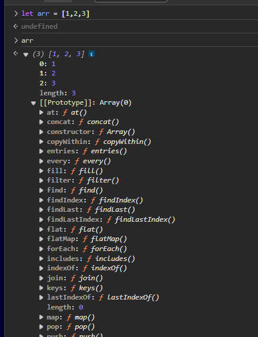

# プロトタイプ・クラス・オブジェクト指向プログラミング

## プロトタイプとは

継承機能のために存在する機能。
https://developer.mozilla.org/ja/docs/Learn/JavaScript/Objects/Object_prototypes

例えば、arrayにはさまざまなメソッドが存在するが、以下のようにコンソール画面でarrの中身を見てみると、メソッドが存在するのではなくて、prototypeの中に様々な関数が存在する



prototypeオブジェクトがすべての配列の元になっているひな型できなもので、これをもとにArray.prototypeオブジェクト以下のメソッドを、継承することができるらしい。


なので、以下のように、array型にhoge関数を追加することも可能ではあるが、可読性の観点からあまりよくない。
もちろん、既存のメソッドを書き換えることもできるが、もちろん怒られるため、やらないこと。
```javascript
    Array.prototype.hoge = function() {

    }
```

## オブジェクト指向プログラミング

根本はプログラムをわかりやすくしていくこと
わかりやすくなっていなかったら意味がないな。


### ファクトリ関数

以下のように書いたときのmakeColor関数のこと.
要はオブジェクトを生成する関数のようなもの。
今はクラス（少し前はコンストラクタ関数）を使うため、使われない

```javascript
function makeColor(r, g, b) {
    const color = {};

    color.r = r;
    color.g = g;
    color.b = b;

    //rgbの値を使いやすい文字列に変換する関数
    color.rgb = function () {
        const { r, g, b } = this; //分割代入というらしい
        return `rgb(${r}, ${g}, ${b})`;
    }

    //rgbの値をHexで表示する関数
    color.hex = function () {
        const { r, g, b } = this; //分割代入というらしい
        // const r = this.r;
        // const g = this.g;
        // const b = this.b;
        return '#' + ((1 << 24) + (r << 16) + (g << 8) + b).toString(16).slice(1);
    }

    return color;
}
```

デメリットとしては、
ファクトリ関数の中で、hex関数やrgb関数が定義されているので、
ファクトリ関数を呼び出すと毎回関数が定義されるということ


### 分割代入（関係ないけど）

クラスオブジェクトのメンバに関して以下のように書いているものは
```javascript
        const r = this.r;
        const g = this.g;
        const b = this.b;
```

以下のように省略して書くことができる
```javascript
        const { r, g, b } = this;
```

### コンストラクタ関数

豆知識：オブジェクトを生成する関数の名前は一文字目を大文字にすること

ファクトリ関数と違って、何度も関数が定義されない方法

ただ、他の言語と違って、thisがややこしいので、
他の言語と同じようにコンストラクタを定義して、そのまま使おうとすると、thisがクラスを表さず、windowオブジェクトを示してしまう

なので、newを使うことで、thisを使えるようにした

さらに、prototypeを介することで、何度も関数が定義されないようにした

#### newの使い方

1. 空白のプレーンなJavaScriptオブジェクトを生成する
2. 他のオブジェクトを親プロトタイプとすることで、新しく生成されたオブジェクトとほかのオブジェクトをリンク(コンストラクタを設定)する
3. ステップ1で新しく作成されたオブジェクトをthisコンテキストとして渡す
4. 関数がオブジェクトを返さない場合はthisを返す

#### コンストラクタ関数の使い方

コンストラクタはメンバ変数に代入するようなものだけを記載する。

```javascript
function Color(r, g, b) {
    this.r = r;
    this.g = g;
    this.b = b;
}

Color.prototype.rgb = function () {
    const { r, g, b } = this; //分割代入というらしい
    return `rgb(${r}, ${g}, ${b})`;
}

Color.prototype.hex = function () {
    const { r, g, b } = this; //分割代入というらしい
    return '#' + ((1 << 24) + (r << 16) + (g << 8) + b).toString(16).slice(1);
}
```

呼び出すときは以下のように記載する

```javascript
const color1 = new Color(124, 232, 12);
```

これで、問題は解決したが
他の言語と比べて、メソッドが{}の外に記載されるのが違和感がある
なので、クラスを使う

### クラス

クラスを使えば以下のように書ける。

```javascript
class Color {
    constructor(r, g, b, name) {
        this.r = r;
        this.g = g;
        this.b = b;
        this.name = name;
        this.calcHSL();
    }
    innerRGB() {
        const { r, g, b } = this; //分割代入というらしい
        return `${r}, ${g}, ${b}`;
    }
    rgb() {
        return `rgb(${this.innerRGB()})`;
    }

    hex() {
        const { r, g, b } = this; //分割代入というらしい
        return '#' + ((1 << 24) + (r << 16) + (g << 8) + b).toString(16).slice(1);
    }

    rgba(a = 1.0) {
        return `rgba(${this.innerRGB()}, ${a})`;
    }
}
```

### 継承クラス

例えば、以下のような二つのクラスがあったとする
コンストラクタは同じで、関数も同じ部分がある

```javascript
class Cat {
    constructor(name, age) {
        this.name = name;
        this.age = age;
    }
    eat() {
        return `${this}がご飯を食べている`;
    }
    meow() {
        return 'ニャー！！！'
    }
}

class Dog {
    constructor(name, age) {
        this.name = name;
        this.age = age;
    }
    eat() {
        return `${this}がご飯を食べている`;
    }
    bark() {
        return 'ワン！！！'
    }
}
```

extendsを使えば、ほかのクラスを継承することができて、以下のように記載することができる

```javascript
class Pet {
    constructor(name, age) {
        this.name = name;
        this.age = age;
    }
    eat() {
        return `${this}がご飯を食べている`;
    }
}
class Cat extends Pet {
    meow() {
        return 'ニャー！！！'
    }
}

class Dog extends Pet {
    bark() {
        return 'ワン！！！'
    }
}
```

継承先のメソッドと継承している側のクラスのメソッドが同じ名称だと、
継承している側の方が使われる。
そのため、継承先のPetのメンバー変数だけでは足りなくて、追加でメンバー変数を与えると以下のようになる

```javascript
class Pet {
    constructor(name, age) {
        this.name = name;
        this.age = age;
    }
    eat() {
        return `${this}がご飯を食べている`;
    }
}
class Cat extends Pet {
    meow() {
        return 'ニャー！！！'
    }
}

class Dog extends Pet {
    constructor(name, age, jumpHeight = 5) {
        this.name = name;
        thie.age = age;
        this.height = jumpHeight;
    }
    bark() {
        return 'ワン！！！'
    }
}
```

これだとまた無駄な部分が出てきてしまう。
なので、superを使うと以下のように省略して記載することができる

```javascript
class Dog extends Pet {
    constructor(name, age, jumpHeight = 5) {
        super(name, age);
        this.height = jumpHeight;
    }
    bark() {
        return 'ワン！！！'
    }
}
```


