# MongoDB

## DBの必要性

* データベースは、大量のデータを効率的に扱い、保存することができる
* データの挿入、紹介、更新を容易にするツールを提供してくれる
* 一般的にデータへのアクセスを制御するセキュリティ機能を備えている
* スケールする

## SQL VS NOSQL

### SQLデータベース

SQLデータベースはリレーショナルデータベースのことで、データを挿入する前に、テーブルのスキーマをあらかじめ定義する

### NoSQLデータベース

NoSQLなデータベースはSQLを使用しない。
ドキュメント型、キーバリュー型、グラフ型等、様々な種類がある
スキーマを定義してから（形を決めてから）ではないので、MUを作るにはこちらがよさそう
* MongoDB
* Couch DB
* Neo4j
* Cassandra
* Redis


## MongoDB

https://www.mongodb.com/docs/manual/

### なぜMongoDBなのか

Node.jsやExpressと一緒によく使われている（MEANやMERNスタックという）
MongoDB
Express
Angular or React
Nodejs

また、javascriptを学んだ人からすると、とっつきやすい

コミュニティもでかい

Stackoverflowでも最も需要のあるDBでもPostgreSQLについで二つ目に来ている

### インストール方法

Windows上でMongoDBをセットアップするには、以下の二つの手順が必要です：

1. MongoDB Community Serverインストール

2. MongoDB Shellインストール


#### MongoDB Community Server版インストール
1. MongoDB Community Server版をダウンロードしてください：https://www.mongodb.com/try/download/community

2. ページをスクロールダウンし、ダウンロードページから以下のオプションを選んでください：

* Version： 7.x.x — 【注意】バージョンは時期によって変わります

* Platform：Windows

* Package：msi

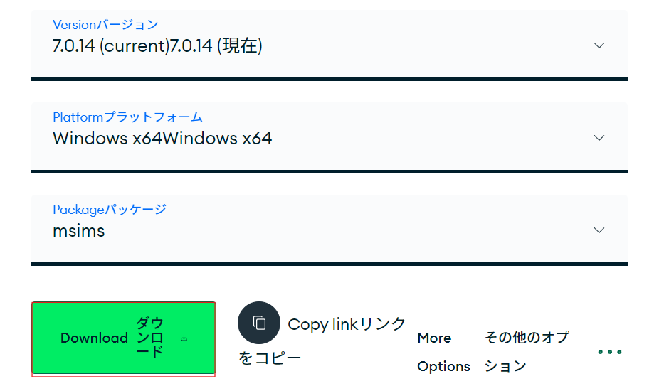

   緑色の「ダウンロード」ボタンをクリックすると、.msi拡張子のMongoDB Windowsインストールファイルがコンピュータにダウンロードされます。

3. ダウンロードが終わったら、 .msiインストールファイルを実行してください。
   注：インストールファイルを実行する際にセキュリティダイアログが表示された場合は、許可してください。

4. インストール準備ができたら、次の画面が表示されます。ここで「Next」を押してください：

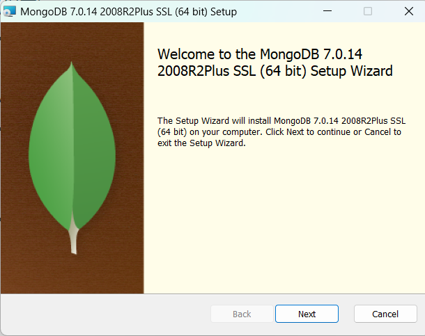


5. ライセンス契約を読んだあと「I accept the terms in the License Agreement」チェックボックスにチェックを入れ、また「Next」を押してください。

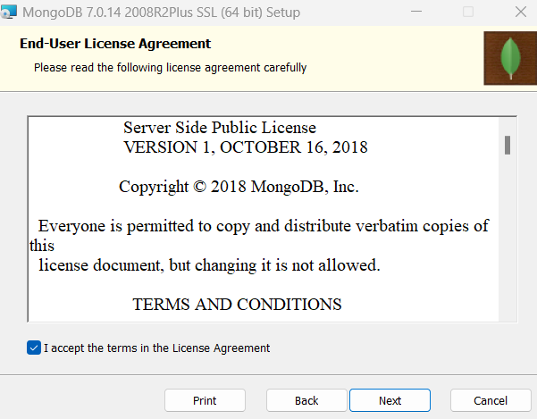


6. セットアップタイプを選ぶ画面で、「Complete」ボタンをクリックしてください：

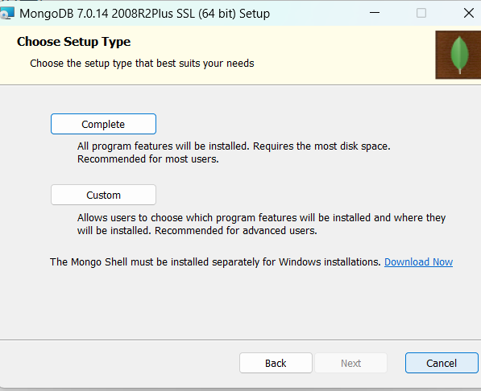


7. 「サービスカスタマイズ」画面では、以下のスクリーンショットに示されているように、提案されたオプションをそのままにしておきます。MongoDBデータベースサーバーがバックグラウンドで自動的に実行されるように、「Install MongoD as a Service」が選択されていることを確認し、「Run service as Network Service user」オプションを選んでください。また、「Service Name」、「Data Directory」、「Log Directory」のフィールドのデフォルト値をそのままにしておいても構いません。

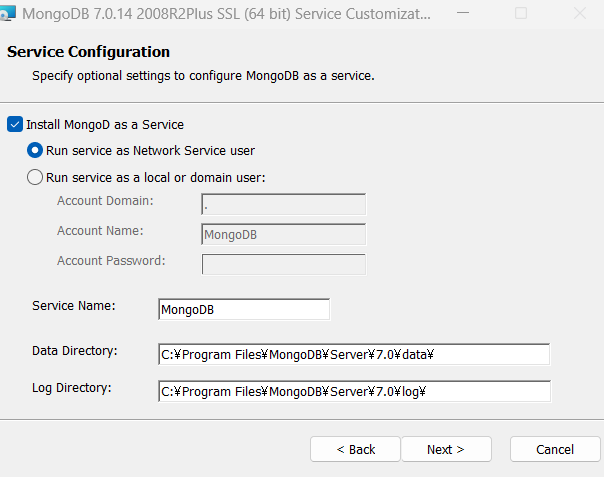


8. 次の画面では、「Install MongoDB Compass」オプションにチェックを入れたままにし、「Next」を再びクリックしてください。

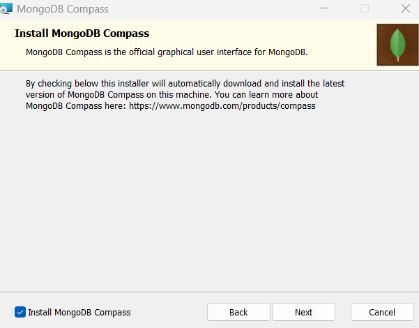

9. その後、「Install」ボタンをクリックして、MongoDBのインストールを開始しします
* 注：インストールが開始され、セキュリティダイアログが表示された場合は、許可してください。

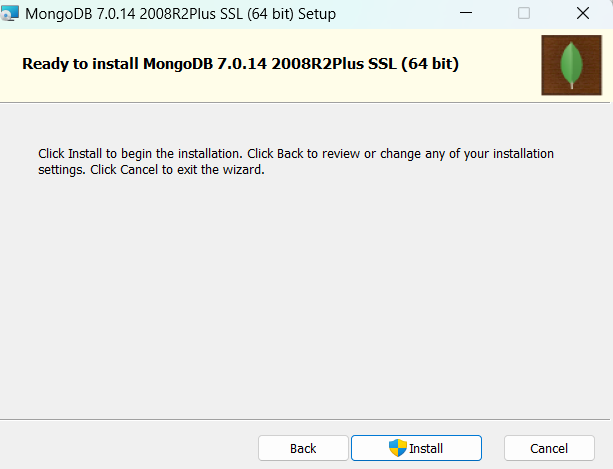

10. インストールが終了するまで待ちます。その後、最後の画面で「Finish」ボタンをクリックします：

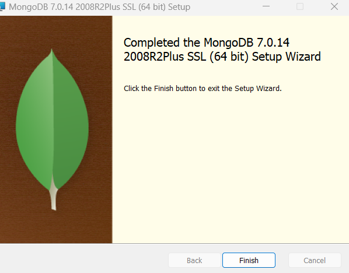

次はMongoDB Shellのインストールに移ります。

#### MongoDB Shellインストール

MongoDBバージョン6以降、mongoターミナルコマンドはMongoDBシェルを起動する方法としては含まれなくなりました（これについては、「MongoDBのシェル」という講義で学びます）。現在は、MongoDBシェルを別途インストールする必要があります。以下の指示に従ってMongoDBシェルをインストールすると、mongoshターミナルコマンドが使えるようになります。本コース内ではmongoコマンドの代わりにmongoshコマンドを使用してください。今後の講義でmongoコマンドを入力するのを見た場合は、代わりにmongoshコマンドを入力してください。

1. ここでMongoDBシェル（mongosh）の公式ダウンロードページに行きます：https://www.mongodb.com/try/download/shell

2. ページをスクロールダウンし、MongoDBシェルのダウンロードページから以下のオプションを選んでください：

* Version：MongoDBシェルの最新版を選んでも構いませんが、Windowsのバージョンと互換性があることを確認してください。
  - Windows 10以降の場合は、MongoDBシェルバージョン2.*を選ぶことができます（Windowsのバージョンがこれと互換性がある場合は推奨されます）。
  - Windows 8.1以降の場合は、MongoDBシェルバージョン1.*を選ぶことができます。

* Platform：
  - 前のステップでMongoDBシェルバージョン2.*を選んだ場合は、ここでのプラットフォームとしてWindows x64（10+）オプションを選んでください。
  - 前のステップでMongoDBシェルバージョン1.*を選んだ場合は、プラットフォームオプションのデフォルト値を選ばないでください。代わりに、プラットフォームメニューをクリックし、メニューをスクロールダウンしてWindows MSIオプションを見つけるまでスクロールダウンします。このオプションを正確に選んでください（他のオプションは選ばないでください）：Windows 64-bit（8.1+）（MSI）

* Package：msi （このオプションが選択されていることを確認してください）

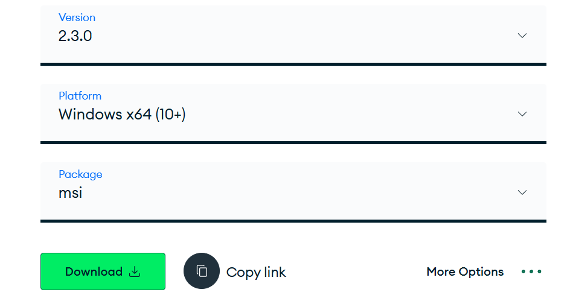

   次に、緑色の「Download」ボタンをクリックすると、.msi拡張子のMongoDBシェル（mongosh）Windowsインストールファイルがコンピュータにダウンロードされます。


3. ダウンロードが完了したら、.msiインストールファイルを実行します。
* 注意: インストールファイルを実行するときにセキュリティダイアログが表示される場合は、許可してください。

4. インストール準備が完了すると、次のような画面が表示されます。ここで「Next」を押してください：

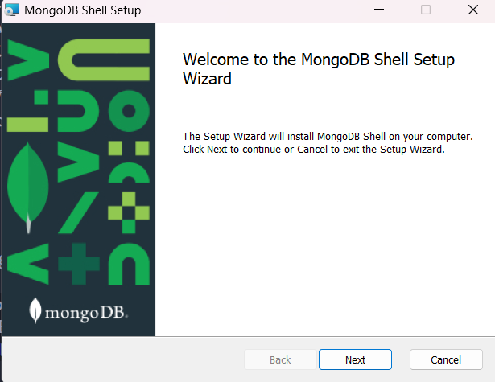


5. 次のインストール設定はデフォルトのままで構いません。「Next」を再度クリックしてください：

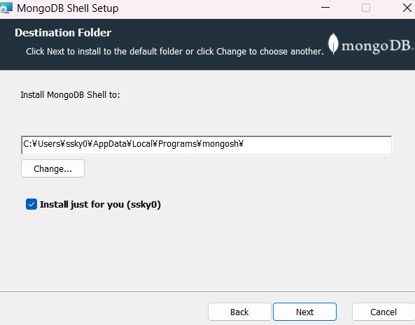


6. 「Install」ボタンをクリックして、MongoDB Shell（mongosh）のインストールを開始してください：

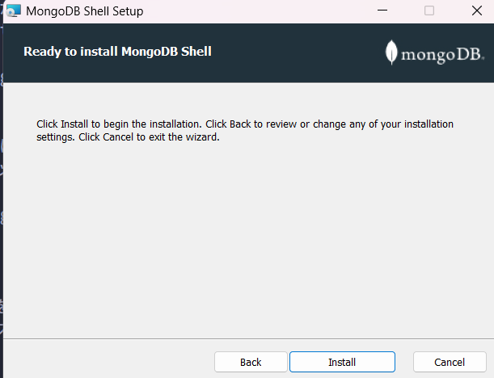


7. インストールが完了したら、「Finish」ボタンをクリックして、インストールウィザードを終了してください：

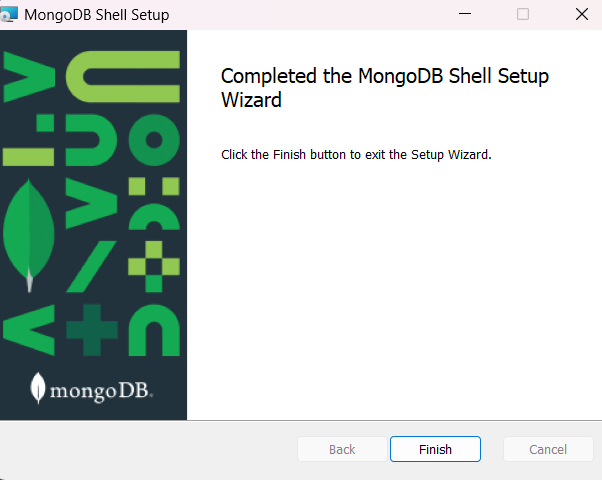


これで完了です！これでMongoDB Shellがインストールされました。次にターミナルを開くとき（注：すでにターミナルウィンドウを開いている場合は、必ずそれを再起動してください）、mongoshコマンドを使用してMongoDB Shellを起動できるはずです。上述のように、このコースを進める際は、以前のMongoDBのバージョンで使用されていたmongoコマンドの代わりに、今回はmongoshコマンドを使用してください。

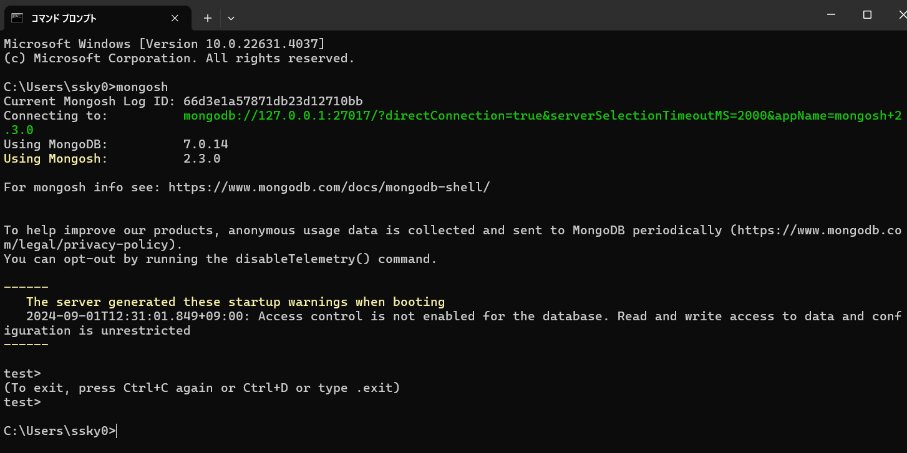

また、注意点として：mongoshコマンドで起動するMonogDB Shellは、講義で使用しているmongo shellと比べて見た目が若干異なるかもしれませんが、これは無視して構いません。新しいMongoDB shellを使用してレクチャーに従えば正しく動作します。

Windows用のこのMongoDBインストールチュートリアルに関して何か助けが必要な場合は、Q&Aボードで聞いてください。

あまりUdemyだと説明がなかったので以下のサイト等を確認すること
https://qiita.com/yoshiaki1973/items/e5dab5b88f106a4026b2

### MongoDBのサービスの実行

インストールされると、自動的にサービスが実行されている
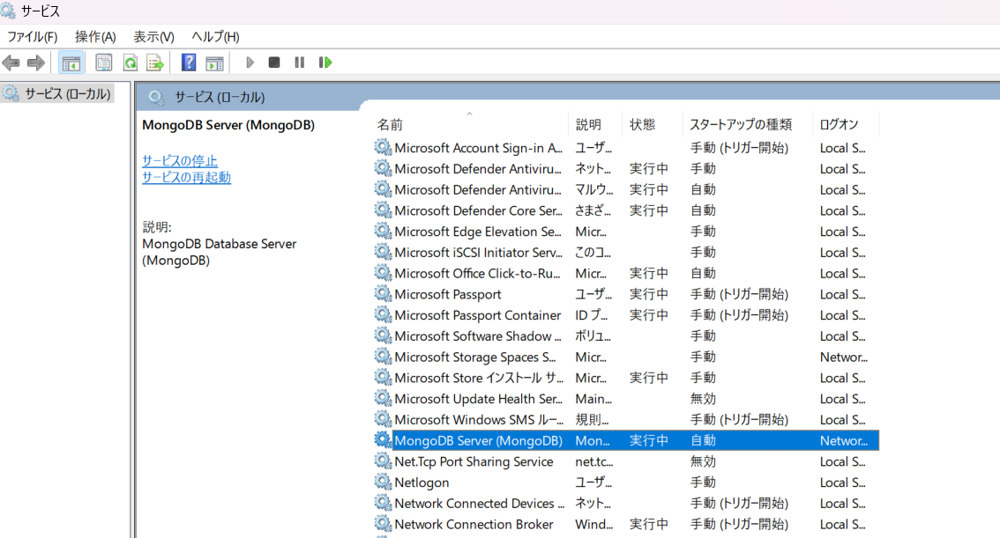

### DBの作成

以下のようにuseコマンドを使うだけ
```javascript
use newdb
```
### BSON

Jsonは以下の弱点がある
* textベースなので、遅い
* spaceが多いので、容量が多い
* サポートしているデータの型数が少ない。（文字列、数値）

BinaryのBなので、軽く、扱えるデータは多い
Jsonでは使えなかった、細かいInt型やFloat形などの型や、Date型、バイナリを扱うことができる。

### DB操作

https://www.mongodb.com/docs/manual/crud/

#### DBとCollectionの参照
コレクションに対して操作を行っていく
以下のコマンドで、DBやそのDBが持つcollectionを確認することができる
```javascript
show dbs
show collection
```

#### データの追加

DBのcollectionには以下のようなコマンドで、Insertすることができる
```javascript
db.colorcodes.insertOne({code:'NH-900L', name:'Neutral Black', creator: 'Keita Sawao', comment:'テストで生成した色です'})
```
以下のように複数を追加することも可能
```javascript
db.colorcodes.insertMany([{code:'B-1', name:'Blue', hex: '#0000FF', creator: 'Keita Sawao', comment:'とても青いです'},{code:'R-1', name:'Red',hex: '#FF0000', creator: 'Keita Sawao', comment:'とても赤いです'},{code:'G-1', name:'Green', hex: '#00FF00', creator: 'Keita Sawao', comment:'とても緑です'},{code:'NH-1', name:'Black', hex: '#000000', creator: 'Keita Sawao', comment:'とても黒いです'},{code:'NH-2', name:'White', hex: '#FFFFFF', creator: 'Keita Sawao', comment:'とても白いです'},{code:'RP-1', name:'Pink', hex: '#F035F0', creator: 'Keita Sawao', comment:'とてもピンクです'}])
```


#### データの参照

collection全てのデータを取得する方法は以下の通り

```javascript
db.colorcodes.find()
```

一つのデータを完全一致でとってくるには以下の通り
```javascript
db.colorcodes.find({name: 'Neutral Black'});    //ヒットしたカーソルを返す
db.colorcodes.findOne({name: 'Neutral Black'}); //最初にヒットしたドキュメントを返す
```

#### データの更新

一つのデータを更新する

```javascript
db.colorcodes.updateOne({name: 'Neutral Black'}, {$set: {hex: "#000000"}})    //ヒットしたカーソルを返す
```
複数のデータを更新する

```javascript
db.colorcodes.updateMany({name: 'Black'}, {$set: {hex: "#000000"}});    //ヒットしたカーソルを返す
```

現在の時刻を更新する（追加する）
少し不思議な書き方ではあるが、こういった書き方ができる
```javascript
db.colorcodes.updateOne({name: 'Neutral Black'}, {$currentDate: {lastModified: true}})
```

ちなみに以下の書き方もできる
```javascript
db.colorcodes.updateOne({name: 'Neutral Black'}, {$set: {uppdated: new ISODate("2020-05-18T14:10:30Z")}})
```

replaceOneで置き換えることもできる

ちなみに第二引数に検索条件を追加することもできる

#### データを削除

一つのデータを削除する
```javascript
db.colorcodes.deleteOne({name: 'Neutral Black'})
```

複数のデータを削除する
```javascript
db.colorcodes.deleteMany({name: 'Black'})
```

全てのデータ削除する

```javascript
db.colorcodes.deleteMany({})
```

#### その他演算子

Nestされたデータの検索


```javascript
db.colorcodes.update({name: 'Black'}, {$set: {personality: {isGood: true, isRejected: false}}})
```
上記を検索したいとき以下のように検索する

```javascript
db.colorcodes.find({'personality.isGood':true})
```

https://www.mongodb.com/docs/manual/reference/operator/query/

以下のような値を使うことができる

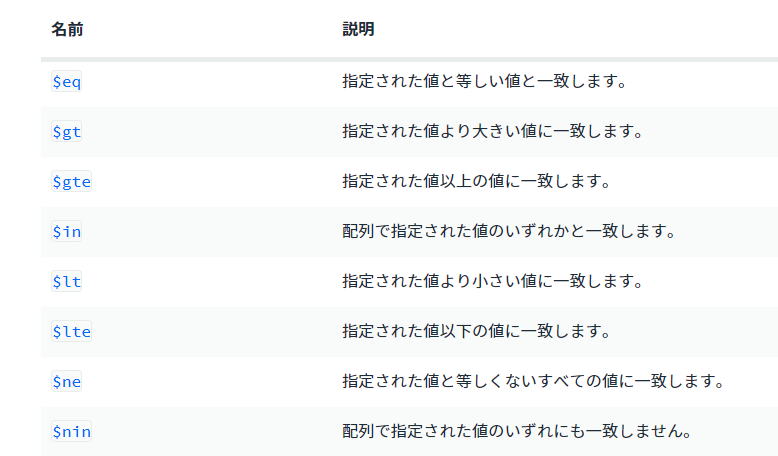

使い方としては、例えば以下のものだとageが8より大きいものを探すということになる
```javascript
db.dogs.find({age: {$gt:8}})
```

8以上となると

```javascript
db.dogs.find({age: {$gte:8}})
```

複数のキーワードで複数の結果を得る方法
```javascript
db.colorcodes.find({name: {$in:['Black','Red']}})
```

## Mongoose(マングース)

MongoDBを直接操作するのではなく、
アプリから直接使えるようにする必要がある
https://www.mongodb.com/docs/drivers/

以下が公式のdriverだが
https://www.mongodb.com/docs/languages/javascript/

MongooseというODMを使っていく

### ODM

Object Data Mapper
Object Document Mapper

MongooseのようなODMは、データベースから送られてくるデータをJavascriptのオブジェクトにマッピングする

Mongooseは、アプリケーションのデータをモデル化して、スキーマを定義することができる。
データを検証したり、複雑なクエリをJavascriptで簡単に作成できる

### ORM

リレーションのあるデータベースだとORMを使う

### 使い方

接続方法
https://mongoosejs.com/

マニュアル　
https://mongoosejs.com/docs/index.html

```javascript
const mongoose = require('mongoose');
mongoose.connect('mongodb://127.0.0.1:27017/test');

const Cat = mongoose.model('Cat', { name: String });

const kitty = new Cat({ name: 'Zildjian' });
kitty.save().then(() => console.log('meow'));
```

mongodbのconnectは
mongoshコマンドを実行し、connecting toの項目で見ることができる
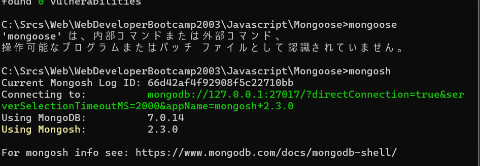