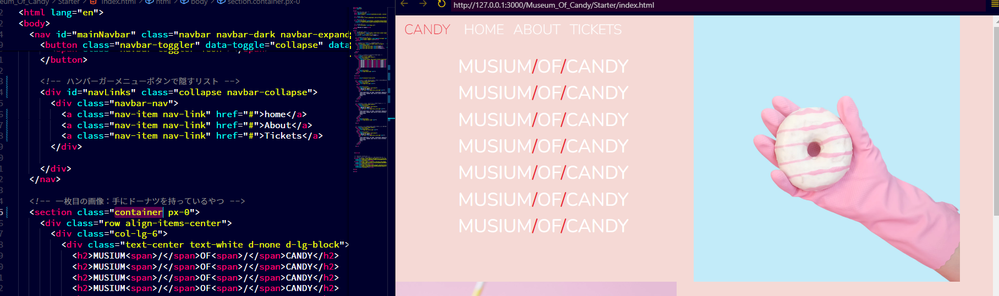
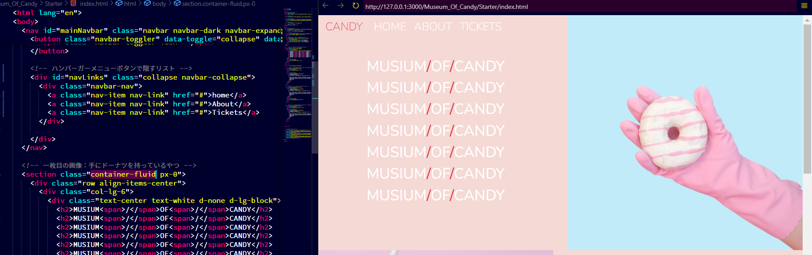

# MusiumOfCandyのメモ

## わからないところ

* キャンディアイコンをサイズによって、表示非表示を切り替える
  ⇒d-noneとd-lg-blockが関係ありそう
* px-0ってなんのクラス？
* 最大画面のとき、文字⇒画像⇒文字⇒画像・・・となっているのに、少し画面の幅を小さくすると画像⇒文字⇒画像⇒文字・・・となる
  ⇒order-mdとかが関係ありそう
* ページをスクロールさせるとNavバーの背景色が変わる

## 個人的に調べること
* data-toggle属性

## ナビゲーションバー

### aria-label

ボタンは、視覚障碍者が活用するScreen Readerが、どんなボタンなのかを知るすべがないので、aria-label属性にどんなボタンなのかを記載する

### 【Bootstrap】py-0, px-0

py-0は上下のPaddingが0ということ
px-0は左右のpaddingが0ということ

### 【Bootstrap】fixed-top

画面をスクロールしたときに、指定した要素を画面の最上位に引っ付かせる

## Body

### containerとcontainer-fluid

普通のcontainerクラスを使うと以下のように、両サイドに空間が生まれてしまう

container-fluidを使えば、以下のように両サイドに空間が生まれない

### img-fluid

bootstrapで画像をレスポンシブにしたいなら、
img-fluidクラスが使える（なんで、画像に対して、100%ってしないんだろう
https://getbootstrap.com/docs/4.0/content/images/

### d-none
displayのd
このクラスを設定すると、表示されなくなる

### d-lg-block, d-lg-inline
このクラスを設定すると、large以上の表示になった時に、ブロック表示。もしくはinline表示にする
d-noneと組み合わせて利用したりする

### mt-5

mtはMargin-Topのこと
上にマージンが追加されると思えばいい

### 余白を作る手段：rowとcolによって追加する

