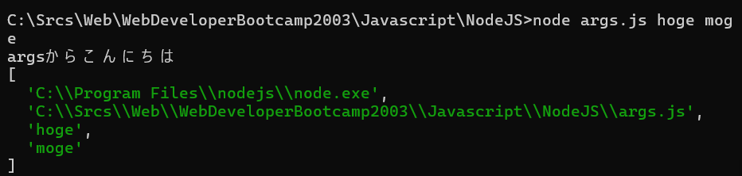
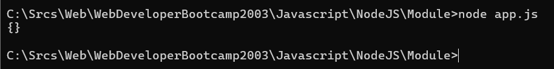
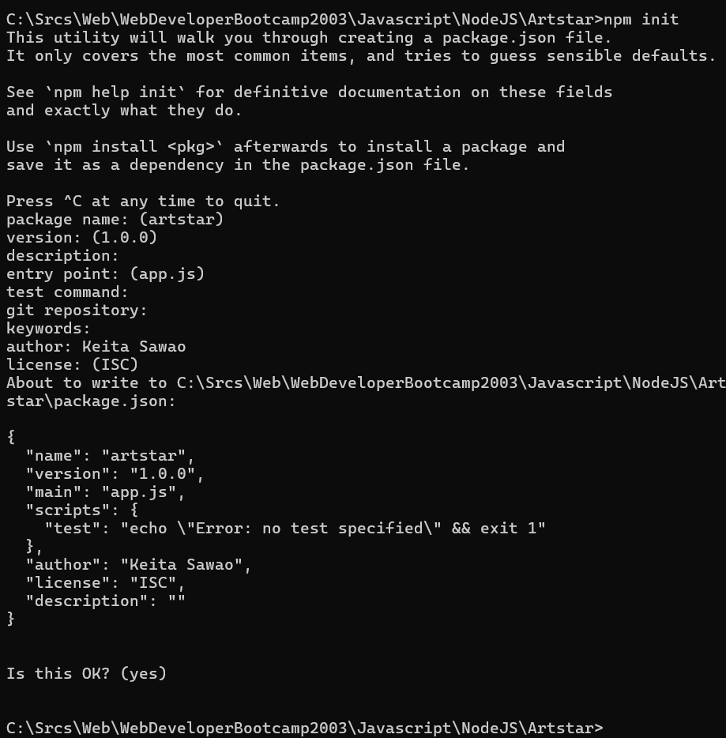

# Node.js

## Node.jsとは

Javascriptのランタイムのことで、ブラウザの外でJavascriptを実行することができる。

DOMはNode.jsには使われないが、Javascriptでサーバーサイドのコードを書くことができる
2015年ごろからNode.jsが使われているようなアンケート調査結果が出ているらしい

VS CodeもNode.jsのelectronというライブラリを使って作られらしい

## Node.js用語・使い方メモ

* REPL：レプルと呼ばれる。コマンドプロンプトでNodeと入力したときとかの、入ったら出れない感じのやつ
* ファイルの実行：Node "ファイル名.js"　でjsファイルを実行できる
* バージョンの確認：node -v


## Process

グローバルオブジェクトの中にあるもので、Node.js自体の情報を持っている。メモリの使用量とか
https://nodejs.org/docs/latest-v20.x/api/process.html

Node.jsのREPLでprocessと入力すると、実行できる

#### Process.argv

引数を呼び出すことができる

例えば、コマンドプロンプト側で以下のように入力したとき
```javascript
    node args.js hoge moge
```

args.js側で以下のように記載していれば
```javascript
    console.log('argsからこんにちは');
    console.log(process.argv);
```

以下のような結果になる



## File System

ファイルを作成したり、権限を変えたりすることができる
https://nodejs.org/docs/latest-v20.x/api/fs.html

Node.jsでは、基本的に同期版と非同期版の関数があり、
非同期版の関数の中では、Promise用とasync用があるので、三つの種類がある

### writeFile

以下のように記載する
第一引数では、ファイル名
第二引数では、中に入れ込みたいコンテンツ
```javascript
writeFile('message.txt', 'Hello Node.js', 'utf8', callback); 
```


## moduleを読み込む

同じディレクトリにmath.jsというファイルがあったとしても
以下のようにrequireを使っても空のオブジェクトしか手に入らない

```javascript
const math = require('./math');

console.log(math);
```



利用される側のJavascriptを側でexportを宣言してあげる必要がある

```javascript
const add = (x, y) => x + y;

const PI = 3.14159

const square = x => x * x;

const math = {
    add: add,
    PI: PI,
    square: square
};
module.exports = math;

```

上記はまとめて記載しているが、別々に記載してもいい
```javascript
module.exports.add = add;
module.exports.PI = PI;
module.exports.square = square;

```

### ディレクトリを読み込む

ディレクトリをrequireすると、index.jsを読み込むようになる。

## npm

Node Pakcage Managerのこと
以下の二つの意味がある
1. 他の開発者が公開している何万ものパッケージが管理されている場所
2. これらのパッケージをNode.jsのプロジェクトに簡単にインストールし、管理するためのコマンドラインツール
   
ReactやExpress等のパッケージをインストールすることができる

### packageのグローバルインストール

-gをつければ、コマンドプロンプトで使うコマンドを追加することができる

### package.jsonの作り方

プロジェクトを作成するときに、最初に以下のコマンドを実行する
```console
npm init
```


すると以下のようにいくつか質問されるので、答えるとpackage.jsonが生成される

### package.jsonの使い方

例えば、Git-hub上にある誰かが作ったウェブアプリを使いたいとき、
ただダウンロードするだけだと、必要なパッケージが含まれていないため、使用することができない。
そんな時に、package.jsonがダウンロードしたファイルに含まれていいれば、
```console
npm install
```

をするだけで、実行することができる

### 講義メモ

次の講義でfrancというパッケージを使用します。このパッケージのバージョンは6.0.0以降でrequireでは読み込めなくなったため、コースと同様のコードで進めるためには、以下のコマンド
```console
npm i franc langs
```
を、下のようにfrancのバージョンを5.0.0に指定するようにしてください。
```console
npm i franc@5.0.0 langs
```
