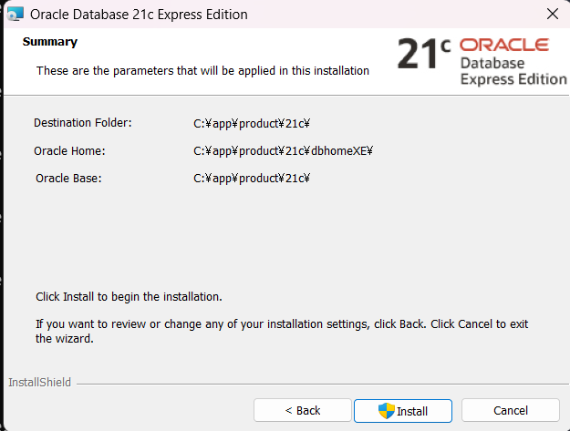

# Oracle 21c Express Editionのセットアップ


## ダウンロード

以下のファイルをダウンロード

https://download.oracle.com/otn-pub/otn_software/db-express/OracleXE213_Win64.zip

## Oracleのインストール

上記ファイルを解凍し、setup.exeを実行
以下に従う

https://qiita.com/manabu-s/items/df29732448669b5429eb

※フォルダーパスも合わせた


データベースのパスワードはいつものやつ(M〇〇〇みたいなやつ)




ユーザー名：system
パスワード：いつもの


##　テーブルスペースの作成

### フォルダを作成する

以下のように何でもいいが、後で表領域を生成するときに指定するフォルダを作成すること


## データベースへの接続

コマンドプロンプトから、以下の命令文を実行し、データベースを接続する：
sqlplus system/先ほどOracleインストールする時設定したパスワード@localhost:1521/XEPDB1

※PDBにアクセスしないといけない

## 表領域生成

以下の命令文を実行し、テーブルスペースを作成する
```console
create tablespace test_space
datafile 'C:\app\data\test.dbf' size 100M
autoextend on next 500k maxsize 1024m;
```

## ユーザー（スキーマ）を作成

```console
CREATE USER test
IDENTIFIED BY "test" //ダブルクォーテーションも含む
DEFAULT TABLESPACE test_space
TEMPORARY TABLESPACE TEMP
PROFILE DEFAULT;
```
※ここでORA-65096: 共通ユーザーまたはロール名が無効です。と表示された場合には、PDBにアクセスしておらず、ルートコンテナにアクセスしてしまっている可能性が高い
https://cosol.jp/knowledge/knowledge_post/ora-65096/


## 権限付与

```console
grant dba to test;
```

## SQL Developerのダウンロード


VS Codeの拡張機能で問題なし

## 参考

https://qiita.com/manabu-s/items/df29732448669b5429eb
