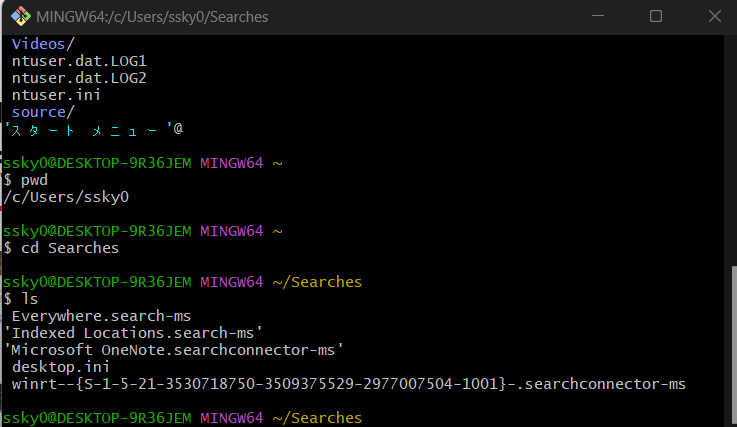

# ターミナルを使いこなそう

## ターミナル

コンピュータを操作するためのテキストベースなインターフェース昔は物理的な端末のことだったらしいが、今はターミナルソフトのことを指す

## シェル

ユーザーから入力を受け取ってコマンドを実行するプログラムの一種
ターミナル上で動作する
昔はターミナルがハードのことで、そのハードで使われるシェルのことだった。
今はターミナルの中の一部のソフトということ

## BASH

広く使われているシェルの一種
少し前までMac標準のシェルだった。

今はzsh(zシェル)らしい

## コマンドプロンプト

https://techmania.jp/blog/cmd0002/
https://cmd.konomi.app/ja/commands/move/

## コマンド集

### ls / dir

lsコマンドは現在のディレクトリの中のファイルを出力する
```console
    ls
```

ちなみに、以下のように~(チルダ)が表示されているがこれはホームディレクトリを指す

コマンドプロンプトならdir



### pwd

print working directoryの略
今どのディレクトリにいるのかを表示する

### cd

ディレクトリを移動する

一つ上のディレクトリに行くには
```console
    cd ..
```
と記載すればいい

絶対パスは/から入力すること
例:/c/Users/

### mkdir

make directoryの略
ディレクトリを生成する
複数作りたい場合は、スペース区切りで入力する

### man

manualの略
例: manual ls
と書けば、lsのマニュアルが表示されるらしいが、Git bashだとない
help と書いたらオプションリストが出てくる

### touch / type nul >

ファイルを生成することができる
本来は、アクセス日時や更新日時を変更することができるのがメイン機能らしい
windowsでは
type nul >　hoge.js
のように記載する

### rm

完全に削除させる（ゴミ箱には入らない）
フォルダは削除できない

-rfを追加すると、ディレクトリとそれ以下のファイルを削除する

### rmdir

空のフォルダを削除する