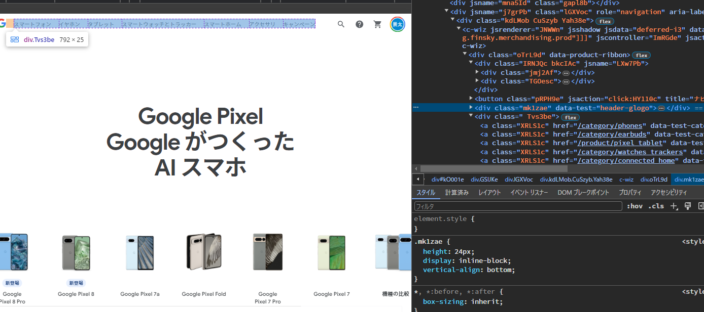

# Web UI

## GAFA

### Google Pixel

https://store.google.com/jp/category/phones?hl=ja

#### 見出しについて
以下のように、webページにアクセスすると、文字が前面に表示され
製品はいくつもあるが、最も言いたいことが最も大きく表示されている

#### 製品情報について

基本的にCardデザインではあるが、
PCとスマホで表示が若干違う

画像も別に用意する必要はあるかも
カードデザインの中には
* 名称
* キャッチコピー的なもの
* 値段
* 支払い方法
* 詳細ボタン
* 購入リンク

が記載されている

#### おすすめの機能欄

例えば、Google Pixelの機能のキャッチコビーを一番最初に持ってきいる

ウェブ版だと文字⇒画像⇒画像⇒文字だが

スマホ版だと、文字⇒画像⇒文字⇒画像に代わる

パターンとして、
キャッチコピー前面に表示⇒詳細説明をカードデザインで示す
という感じ
サイドバーは使っていない

